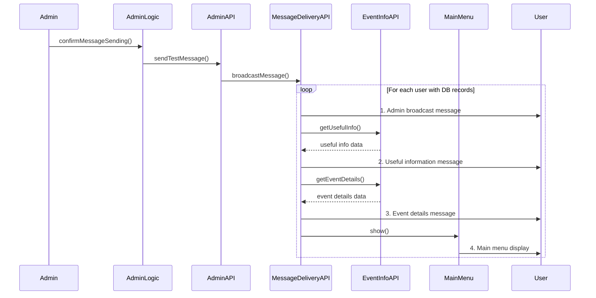
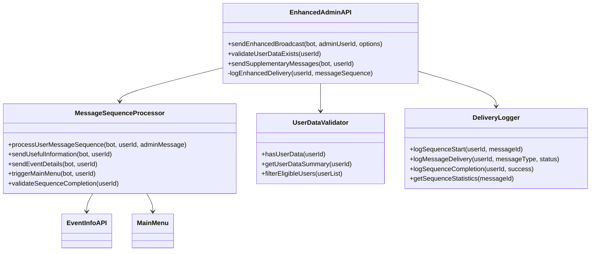

# Техническое решение улучшения админских уведомлений

## Обзор

Данный документ описывает улучшение системы админской рассылки для автоматической доставки дополнительной информации после отправки админских сообщений. Когда администратор отправляет сообщение рассылки, пользователи с данными в базе данных получат последовательность из трех сообщений с последующим автоматическим вызовом меню.

## Краткое описание требований

При отправке админского сообщения система должна:

1. Доставить оригинальное сообщение админской рассылки
2. Отправить дополнительное сообщение из поля меню "Полезная информация"
3. Отправить дополнительное сообщение из поля "Подробная информация о торжестве"
4. Автоматически выполнить команду `/menu` для пользователя

Данное улучшение применяется только к пользователям, которые имеют записи данных в базе данных.

## Архитектура

### Анализ текущей системы

Существующая система админской рассылки состоит из:

- `AdminLogic.confirmMessageSending()` - обрабатывает подтверждение админской рассылки
- `AdminAPI.sendTestMessage()` - выполняет фактическую доставку сообщений
- `MessageDeliveryAPI.broadcastMessage()` - обрабатывает массовую отправку сообщений
- `EventInfoAPI` - предоставляет доступ к полезной информации и деталям события

### Улучшенный поток сообщений



### Архитектура компонентов



## Стратегия реализации

### Фаза 1: Основная обработка последовательности сообщений

#### 1.1 Класс MessageSequenceProcessor

Создание нового утилитарного класса для обработки улучшенной последовательности доставки сообщений:

**Расположение**: `/utils/message-sequence-processor.js`

**Ключевые методы**:

- `processUserMessageSequence(bot, userId, adminMessage)` - оркестрирует всю последовательность
- `sendUsefulInformation(bot, userId)` - доставляет сообщение с полезной информацией
- `sendEventDetails(bot, userId)` - доставляет сообщение с деталями события
- `triggerMainMenu(bot, userId)` - вызывает отображение главного меню
- `validateSequenceCompletion(userId)` - гарантирует доставку всех сообщений

**Точки интеграции**:

- Использует существующий `EventInfoAPI.getUsefulInfo()`
- Использует существующий `EventInfoAPI.getEventDetails()`
- Использует существующий метод `MainMenu.show()`
- Задействует `MessageDeliveryAPI` для надежной доставки

#### 1.2 Валидация данных пользователей

**Расположение**: `/utils/user-data-validator.js`

**Назначение**: Определить, какие пользователи должны получать улучшенные последовательности сообщений

**Ключевые методы**:

- `hasUserData(userId)` - проверяет наличие записей пользователя в базе данных
- `getUserDataSummary(userId)` - получает профиль данных пользователя
- `filterEligibleUsers(userList)` - фильтрует пользователей, подходящих для улучшенных сообщений

**Критерии валидации**:

- Пользователь существует в таблице `users`
- У пользователя есть данные о статусе присутствия
- Пользователь создавал ответы или взаимодействия

### Фаза 2: Улучшенный Admin API

#### 2.1 Модификации AdminAPI

**Файл**: `/features/admin/api.js`

**Новый метод**: `sendEnhancedBroadcast(bot, adminUserId, options)`

**Стратегия улучшения**:

1. Поддерживать обратную совместимость с существующим `sendTestMessage()`
2. Добавить улучшенный режим, активируемый флагом конфигурации
3. Фильтровать пользователей на основе наличия данных
4. Обрабатывать каждого подходящего пользователя через MessageSequenceProcessor
5. Предоставлять детальную статистику доставки, включая показатели завершения последовательности

**Опции конфигурации**:

```javascript
{
  enhancedMode: true,
  includeUsefulInfo: true,
  includeEventDetails: true,
  triggerMenu: true,
  validateUserData: true,
  sequenceDelay: 2000  // milliseconds between messages
}
```

#### 2.2 Улучшение статистики доставки

**Расширенное отслеживание статистики**:

```javascript
{
  total: number,
  eligibleForEnhanced: number,
  enhancedSequenceCompleted: number,
  standardDelivered: number,
  usefulInfoDelivered: number,
  eventDetailsDelivered: number,
  menuTriggered: number,
  sequenceFailures: number
}
```

### Фаза 3: Интеграция содержимого сообщений

#### 3.1 Стратегия получения содержимого

**Источник полезной информации**:

- Использовать метод `EventInfoAPI.getUsefulInfo()`
- Форматировать содержимое из массива `usefulInfo.info`
- Применять единообразное форматирование сообщений

**Источник деталей события**:

- Использовать метод `EventInfoAPI.getEventDetails()`
- Форматировать содержимое из объекта `eventInfo.details`
- Включать все доступные поля деталей (дата, место, описание и т.д.)

**Форматирование содержимого**:

- Единообразные заголовки и подвалы сообщений
- Применять HTML-парсинг при необходимости
- Обеспечивать соблюдение лимитов длины сообщений

#### 3.2 Вызов меню

**Стратегия**: Программное отображение меню вместо симуляции команды

**Реализация**:

- Использовать `MainMenu.show()` напрямую с синтетическим контекстом
- Создать минимальный объект контекста для отображения меню
- Обеспечить правильную генерацию клавиатуры и определение роли пользователя

### Фаза 4: Обработка ошибок и восстановление

#### 4.1 Обработка сбоев последовательности

**Сценарии сбоев**:

- Сбой доставки отдельного сообщения
- Сбой получения полезной информации
- Сбой получения деталей события
- Сбой отображения меню
- Тайм-ауты сети

**Стратегия восстановления**:

- Продолжать последовательность даже при сбое отдельных сообщений
- Логировать каждый сбой с конкретными кодами ошибок
- Предоставлять резервные сообщения при сбоях получения содержимого
- Обеспечивать точное отражение частичных успехов в статистике последовательности

#### 4.2 Ограничение скорости и производительность

**Соображения**:

- Увеличенный объем сообщений (4x сообщения на каждого подходящего пользователя)
- Ограничения скорости Telegram API
- Оптимизация запросов к базе данных
- Использование памяти для больших пользовательских баз

**Стратегия оптимизации**:

- Настраиваемые задержки между шагами последовательности сообщений
- Пакетная обработка с меньшими размерами пакетов
- Кэширование содержимого для повторяющейся информации
- Асинхронная обработка для некритичных шагов последовательности

## Расширения модели данных

### Улучшенное логирование доставки

**Новая таблица**: `enhanced_delivery_logs`

```sql
CREATE TABLE enhanced_delivery_logs (
    id INTEGER PRIMARY KEY AUTOINCREMENT,
    user_id INTEGER NOT NULL,
    admin_message_id TEXT NOT NULL,
    sequence_step TEXT NOT NULL, -- 'admin_message', 'useful_info', 'event_details', 'menu_trigger'
    delivery_status TEXT NOT NULL, -- 'delivered', 'failed', 'skipped'
    delivery_timestamp DATETIME DEFAULT CURRENT_TIMESTAMP,
    error_message TEXT,
    FOREIGN KEY (user_id) REFERENCES users(id) ON DELETE CASCADE
);
```

**Indexes**:

```sql
CREATE INDEX idx_enhanced_delivery_user_message ON enhanced_delivery_logs(user_id, admin_message_id);
CREATE INDEX idx_enhanced_delivery_timestamp ON enhanced_delivery_logs(delivery_timestamp);
CREATE INDEX idx_enhanced_delivery_status ON enhanced_delivery_logs(delivery_status);
```

### Хранение конфигурации

**Расширение таблицы**: `admin_messages`

**Новые поля**:

```sql
ALTER TABLE admin_messages ADD COLUMN enhanced_mode BOOLEAN DEFAULT FALSE;
ALTER TABLE admin_messages ADD COLUMN sequence_completion_rate REAL DEFAULT 0.0;
ALTER TABLE admin_messages ADD COLUMN eligible_users_count INTEGER DEFAULT 0;
```

## Стратегия тестирования

### Модульное тестирование

**Области покрытия тестами**:

- Отдельные методы `MessageSequenceProcessor`
- Логика фильтрации `UserDataValidator`
- Обработка конфигурации `EnhancedAdminAPI`
- Обработка ошибок для каждого шага последовательности
- Форматирование сообщений и получение содержимого

**Файлы тестов**:

- `/tests/unit/test-message-sequence-processor.js`
- `/tests/unit/test-user-data-validator.js`
- `/tests/unit/test-enhanced-admin-api.js`

### Интеграционное тестирование

**Сценарии интеграционных тестов**:

- Полная доставка улучшенной последовательности сообщений
- Смешанные пользовательские сценарии (с данными и без)
- Восстановление после частичных сбоев доставки
- Тестирование производительности с большими пользовательскими базами
- Валидация интеграции с Telegram API

**Файлы тестов**:

- `/tests/integration/test-enhanced-admin-broadcast.js`
- `/tests/integration/test-message-sequence-delivery.js`

### Тестирование производительности

**Критерии производительности**:

- Время завершения последовательности на пользователя < 10 секунд
- Масштабирование использования памяти с количеством пользователей
- Соблюдение ограничений скорости Telegram API
- Производительность запросов к базе данных под нагрузкой

## Конфигурация и развертывание

### Конфигурация окружения

**Новые переменные окружения**:

```bash
ENHANCED_BROADCAST_ENABLED=true
DEFAULT_SEQUENCE_DELAY=2000
MAX_ENHANCED_USERS_PER_BATCH=10
ENHANCED_DELIVERY_TIMEOUT=30000
```

### Переключатель функции

**Объект конфигурации** (`/config/enhanced-admin.js`):

```javascript
module.exports = {
  enabled: process.env.ENHANCED_BROADCAST_ENABLED === "true",
  defaultDelay: parseInt(process.env.DEFAULT_SEQUENCE_DELAY) || 2000,
  maxUsersPerBatch: parseInt(process.env.MAX_ENHANCED_USERS_PER_BATCH) || 10,
  deliveryTimeout: parseInt(process.env.ENHANCED_DELIVERY_TIMEOUT) || 30000,
  enableUsefulInfo: true,
  enableEventDetails: true,
  enableMenuTrigger: true,
}
```

### Стратегия миграции

**Миграция базы данных**: `/database/migrate-enhanced-delivery-logs.js`

**Обратная совместимость**:

- Улучшенный режим опциональный, управляемый конфигурацией
- Существующая функциональность админской рассылки не изменена
- Корректная деградация при сбое улучшенных функций

## Мониторинг и аналитика

### Аналитика доставки

**Ключевые метрики**:

- Показатель завершения улучшенной последовательности на рассылку
- Среднее время доставки последовательности
- Показатели успешного получения содержимого
- Показатели успешного вызова меню
- Пользовательская активность после последовательности

### Стратегия логирования

**Уровни логов**:

- INFO: Начало/завершение последовательности
- WARN: Сбои отдельных шагов с восстановлением
- ERROR: Критичные сбои последовательности
- DEBUG: Детальное пошаговое выполнение

**Формат логов**:

```javascript
{
  timestamp: "2024-01-01T12:00:00Z",
  level: "INFO",
  messageId: "admin_enhanced_1704110400000",
  userId: "123456789",
  step: "useful_info",
  status: "delivered",
  duration: 1200,
  metadata: { contentLength: 145, retryAttempt: 0 }
}
```

## Оценка рисков и их снижение

### Технические риски

**Риск**: Увеличенный объем сообщений, вызывающий ограничения скорости Telegram API
**Снижение**: Реализовать адаптивные механизмы задержки и настройку размера пакетов

**Риск**: Сбои получения содержимого, влияющие на пользовательский опыт
**Снижение**: Реализовать резервное содержимое и корректные сообщения об ошибках

**Риск**: Снижение производительности при больших пользовательских базах
**Снижение**: Асинхронная обработка, оптимизация базы данных и мониторинг ресурсов

### Операционные риски

**Риск**: Путаница администраторов между улучшенными и стандартными рассылками
**Снижение**: Четкие индикаторы UI и диалоги подтверждения

**Риск**: Перегрузка пользователей сообщениями из-за 4x объема сообщений
**Снижение**: Настраиваемый переключатель функции и пользовательские настройки предпочтений

## Критерии успеха

### Функциональные критерии

- ✅ Улучшенные последовательности сообщений успешно доставлены подходящим пользователям
- ✅ Стандартная функциональность рассылки сохранена для всех пользователей
- ✅ Интеграция содержимого работает с существующей системой EventInfo
- ✅ Вызов меню функционирует корректно после последовательности
- ✅ Комплексная обработка ошибок и восстановление

### Критерии производительности

- ✅ Показатель завершения последовательности > 95% для подходящих пользователей
- ✅ Среднее время доставки < 10 секунд на последовательность пользователя
- ✅ Нулевое влияние на производительность стандартной рассылки
- ✅ Увеличение использования памяти < 20% во время улучшенных рассылок

### Операционные критерии

- ✅ Интерфейс администратора четко показывает статус улучшенного режима
- ✅ Статистика доставки предоставляет действенные выводы
- ✅ Функция может быть включена/выключена без изменений кода
- ✅ Обратная совместимость поддерживается во всех админских функциях
