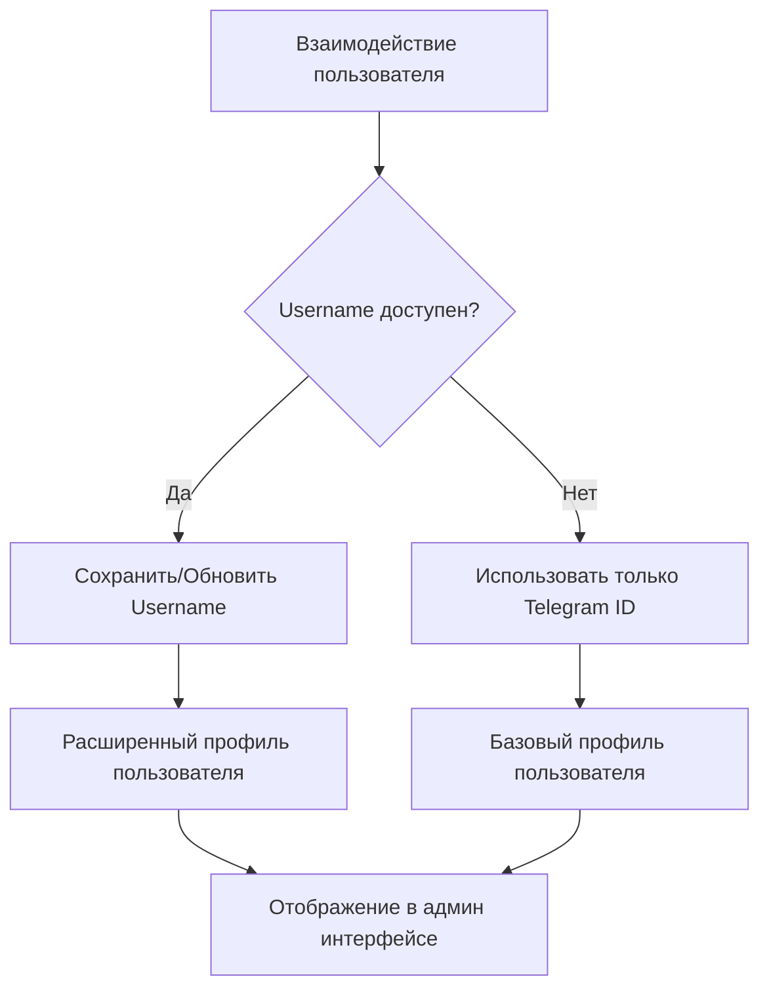

# Доработка схемы базы данных: Добавление поля username

## Обзор

Данный документ описывает доработку существующей схемы базы данных путем добавления поля `username` в таблицу `users` для хранения имен пользователей Telegram (формат @username). Эта доработка улучшит возможности идентификации пользователей и предоставит дополнительный контекст для управления пользователями в системе Telegram бота.

## Анализ текущей схемы

### Существующая структура таблицы users

```sql
CREATE TABLE IF NOT EXISTS users (
    id INTEGER PRIMARY KEY AUTOINCREMENT,
    telegram_id TEXT UNIQUE NOT NULL,
    full_name TEXT NOT NULL,
    attendance_status TEXT DEFAULT 'attending' CHECK (attendance_status IN ('attending', 'not_attending', 'maybe')),
    attendance_updated_at DATETIME DEFAULT CURRENT_TIMESTAMP,
    created_at DATETIME DEFAULT CURRENT_TIMESTAMP,
    updated_at DATETIME DEFAULT CURRENT_TIMESTAMP
);
```

### Current User Identification Method

- Primary identification: `telegram_id` (numeric identifier)
- Display name: `full_name` (user's display name)
- No username storage currently available

## Дизайн доработки схемы

### Улучшенная структура таблицы users

```sql
CREATE TABLE IF NOT EXISTS users (
    id INTEGER PRIMARY KEY AUTOINCREMENT,
    telegram_id TEXT UNIQUE NOT NULL,
    username TEXT,                          -- NEW FIELD
    full_name TEXT NOT NULL,
    attendance_status TEXT DEFAULT 'attending' CHECK (attendance_status IN ('attending', 'not_attending', 'maybe')),
    attendance_updated_at DATETIME DEFAULT CURRENT_TIMESTAMP,
    created_at DATETIME DEFAULT CURRENT_TIMESTAMP,
    updated_at DATETIME DEFAULT CURRENT_TIMESTAMP
);
```

### New Field Specifications

#### username Field

- **Type**: `TEXT`
- **Constraints**: `NULL` allowed (usernames are optional in Telegram)
- **Format**: Stores username without '@' prefix for consistency
- **Purpose**: Store Telegram username for enhanced user identification
- **Index**: Consider adding index for performance optimization

### Стратегия миграции базы данных

#### Скрипт миграции

```sql
-- Добавляем колонку username в существующую таблицу users
ALTER TABLE users ADD COLUMN username TEXT;

-- Добавляем индекс для поля username (опциональная оптимизация)
CREATE INDEX IF NOT EXISTS idx_users_username ON users(username);
```

#### Data Population Strategy

1. **New Users**: Username will be captured during onboarding process
2. **Existing Users**: Username can be populated through:
   - Gradual update when users interact with the bot
   - Batch update script using Telegram API (if needed)
   - Manual admin interface for critical users

### Technical Implementation Requirements

#### Database Layer Updates

1. **Schema Migration**

   - Execute ALTER TABLE statement
   - Add appropriate index
   - Update schema.sql file

2. **Database Utils Enhancement**

   ```javascript
   // Enhanced user creation method
   createUser(telegramId, fullName, username = null) {
     const stmt = this.db.prepare(`
       INSERT INTO users (telegram_id, full_name, username, created_at, updated_at)
       VALUES (?, ?, ?, CURRENT_TIMESTAMP, CURRENT_TIMESTAMP)
     `);
     return stmt.run(telegramId, fullName, username);
   }

   // Username update method
   updateUsername(telegramId, username) {
     const stmt = this.db.prepare(`
       UPDATE users
       SET username = ?, updated_at = CURRENT_TIMESTAMP
       WHERE telegram_id = ?
     `);
     return stmt.run(username, telegramId);
   }
   ```

#### Application Layer Integration

1. **User Registration Enhancement**

   - Modify onboarding process to capture username
   - Extract username from Telegram user object
   - Handle cases where username is not available

2. **User Lookup Enhancement**
   - Add username-based user search capabilities
   - Enhance admin functions to display username
   - Update user profile display logic

### Data Architecture Considerations

#### Username Field Characteristics

- **Uniqueness**: Not enforced at database level (Telegram allows duplicate usernames)
- **Changeability**: Users can change usernames, requiring update mechanism
- **Availability**: Not all Telegram users have usernames
- **Format**: Store without '@' prefix for consistency

#### Indexing Strategy

```sql
-- Оптимизация производительности для поиска по username
CREATE INDEX IF NOT EXISTS idx_users_username ON users(username);

-- Составной индекс для telegram_id и username
CREATE INDEX IF NOT EXISTS idx_users_telegram_username ON users(telegram_id, username);
```

### Интеграция с существующими функциями

#### Улучшение идентификации пользователей



#### Admin Feature Enhancement

- Display usernames in user lists
- Enable username-based user search
- Show username in attendance reports
- Include username in message delivery logs

### Backward Compatibility

#### Existing Code Compatibility

- All existing queries remain functional
- New username field is optional (NULL allowed)
- No breaking changes to current API methods

#### Migration Safety

- Non-destructive schema change
- Graceful handling of NULL username values
- Rollback capability through column removal

### Валидация и ограничения

#### Правила валидации username

```javascript
function validateUsername(username) {
  if (!username) return null // Allow empty usernames

  // Remove @ prefix if present
  const cleanUsername = username.startsWith("@") ? username.slice(1) : username

  // Telegram username validation
  if (cleanUsername.length < 5 || cleanUsername.length > 32) {
    return null
  }

  // Only allow alphanumeric characters and underscores
  const usernameRegex = /^[a-zA-Z0-9_]+$/
  if (!usernameRegex.test(cleanUsername)) {
    return null
  }

  return cleanUsername
}
```

#### Database Constraints

- No UNIQUE constraint (usernames can change)
- No NOT NULL constraint (usernames are optional)
- Case-insensitive storage consideration

### Performance Impact Assessment

#### Query Performance

- Minimal impact on existing queries
- New index may slightly increase INSERT/UPDATE time
- Username-based lookups will be optimized with index

#### Storage Impact

- Additional TEXT field per user record
- Estimated storage increase: ~20-30 bytes per user
- Index storage overhead: ~10-15 bytes per user

### Testing Requirements

#### Unit Tests

- Username validation logic
- Database CRUD operations with username
- NULL username handling

#### Integration Tests

- User registration with username
- Username update functionality
- Admin interface username display
- Backward compatibility verification

### Стратегия отката

#### Экстренный откат

```sql
-- Удалить колонку username при необходимости
ALTER TABLE users DROP COLUMN username;

-- Удалить связанные индексы
DROP INDEX IF EXISTS idx_users_username;
DROP INDEX IF EXISTS idx_users_telegram_username;
```

#### Rollback Considerations

- No data loss for existing fields
- Application code should handle missing username gracefully
- Revert application changes to username-related functionality
