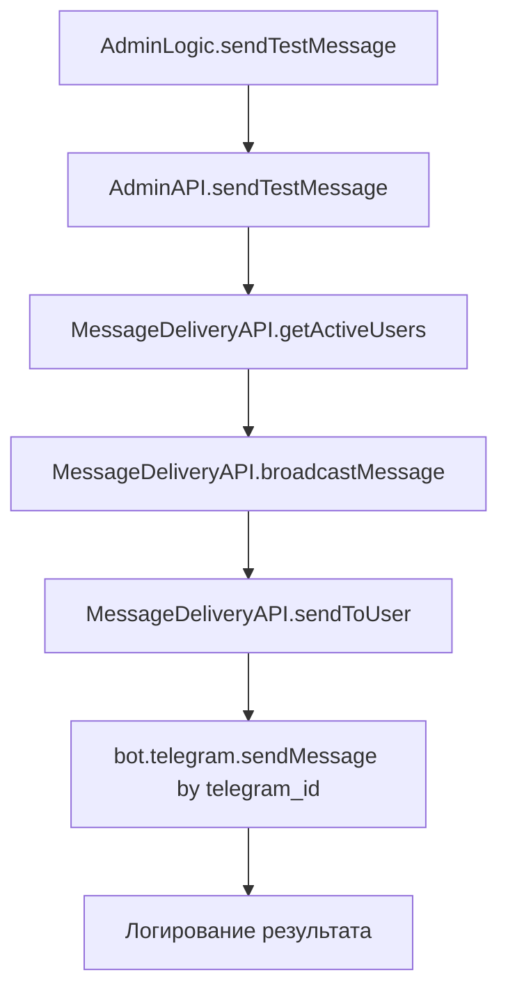
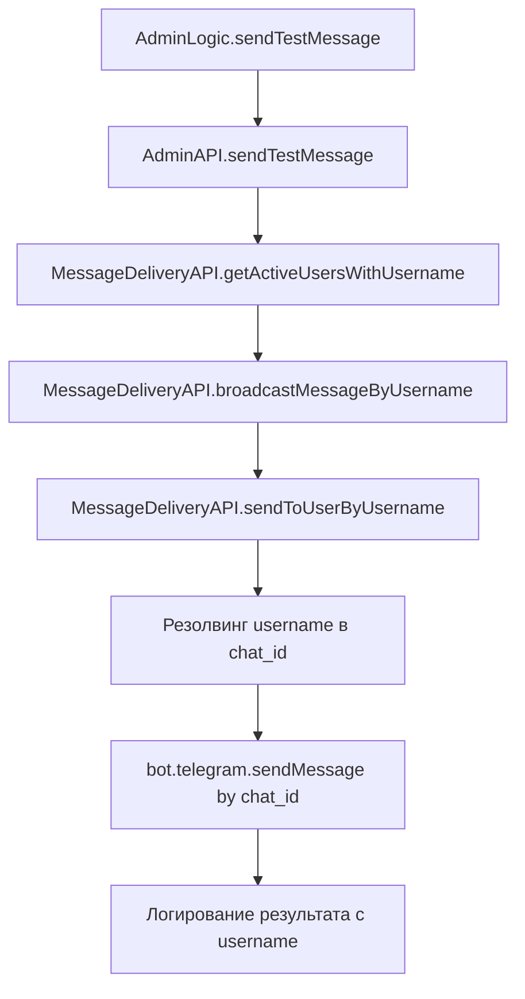

# Доработка механизма отправки админской рассылки по username

## Обзор

Необходимо модифицировать существующий механизм админской рассылки для отправки сообщений по username пользователей вместо telegram_id. Это обеспечит более гибкий и читаемый подход к идентификации пользователей при отправке сообщений.

## Архитектура

### Текущая система отправки сообщений



### Предлагаемая архитектура с username



## Компоненты для модификации

### 1. База данных (database/schema.sql)

Схема уже содержит поле `username` в таблице `users`, необходимо:

- Добавить индекс для оптимизации поиска по username
- Обеспечить уникальность username (при наличии)

### 2. MessageDeliveryAPI (features/message-delivery/api.js)

#### Новые методы:

- `getActiveUsersWithUsername()` - получение пользователей с валидными username
- `sendToUserByUsername()` - отправка сообщения по username
- `broadcastMessageByUsername()` - массовая рассылка по username
- `resolveUsernameToChat()` - резолвинг username в chat_id

#### Модификации существующих методов:

- Обновление логирования для включения username
- Добавление fallback на telegram_id при отсутствии username

### 3. AdminAPI (features/admin/api.js)

#### Модификации:

- Обновление `sendTestMessage()` для использования нового API
- Добавление настроек выбора метода отправки (username/telegram_id)
- Улучшение отчетности с информацией о методе отправки

### 4. AdminLogic (features/admin/logic.js)

#### Обновления:

- Интеграция с новым API отправки
- Обновление интерфейса подтверждения отправки
- Добавление опций выбора метода отправки

## Детальная спецификация изменений

### 1. Обновление схемы базы данных

```sql
-- Добавление индекса для поиска по username
CREATE INDEX IF NOT EXISTS idx_users_username_lookup ON users(username)
WHERE username IS NOT NULL;

-- Добавление составного индекса для оптимизации запросов
CREATE INDEX IF NOT EXISTS idx_users_username_telegram ON users(username, telegram_id);
```

### 2. Новые методы в MessageDeliveryAPI

#### getActiveUsersWithUsername()

- Возвращает пользователей с валидными username
- Включает fallback на telegram_id для пользователей без username
- Фильтрует пользователей с пустыми или null username

#### sendToUserByUsername()

- Принимает username вместо telegram_id
- Использует Telegram API method `getChatMember` для резолвинга
- Обрабатывает ошибки резолвинга username
- Логирует успешные и неуспешные попытки с username

#### resolveUsernameToChat()

- Конвертирует @username в chat_id через Telegram API
- Кэширует результаты для оптимизации
- Обрабатывает различные форматы username (с @ и без)

### 3. Обновление интерфейса администратора

#### Панель выбора метода отправки

- Радио-кнопки: "По Username" / "По Telegram ID" / "Автоматически"
- Статистика доступных username vs telegram_id
- Предупреждения о потенциальных проблемах

#### Отчет о результатах отправки

- Разделение статистики по методам отправки
- Детализация ошибок резолвинга username
- Список пользователей без username

## Модель данных

### Структура пользователя для рассылки

```javascript
{
  id: number,
  telegram_id: string,
  username: string | null,
  full_name: string,
  attendance_status: string,
  send_method: 'username' | 'telegram_id' | 'auto'
}
```

### Результат отправки с расширенной статистикой

```javascript
{
  success: boolean,
  deliveryStats: {
    total: number,
    delivered: number,
    failed: number,
    blocked: number,
    usernameDelivered: number,
    telegramIdDelivered: number,
    usernameResolutionFailed: number
  },
  methodBreakdown: {
    username: { attempted: number, successful: number },
    telegram_id: { attempted: number, successful: number }
  }
}
```

## API интерфейс

### Новые методы MessageDeliveryAPI

#### getActiveUsersWithUsername()

```javascript
async getActiveUsersWithUsername(filterOptions = {}) {
  // filterOptions: { requireUsername: boolean, includeEmpty: boolean }
  // Возвращает: { success: boolean, users: Array, stats: Object }
}
```

#### sendToUserByUsername()

```javascript
async sendToUserByUsername(bot, username, messageText, messageId, options = {}) {
  // Отправка по username с fallback на telegram_id
  // Возвращает: { success: boolean, method: string, userId: string, status: string }
}
```

#### broadcastMessageByUsername()

```javascript
async broadcastMessageByUsername(bot, messageText, messageId, options = {}) {
  // options: { preferUsername: boolean, fallbackToTelegramId: boolean }
  // Массовая рассылка с приоритетом username
}
```

## Обработка ошибок

### Типы ошибок username

1. **username_not_found** - username не найден в Telegram
2. **username_resolution_failed** - техническая ошибка резолвинга
3. **username_blocked** - пользователь заблокировал бота
4. **username_invalid** - неверный формат username

### Стратегия fallback

1. Попытка отправки по username
2. При неудаче - попытка по telegram_id (если доступен)
3. Логирование метода и причины переключения
4. Обновление статистики по методам

## Настройки конфигурации

### Переменные окружения

```env
# Предпочтительный метод отправки: username, telegram_id, auto
PREFERRED_SEND_METHOD=username

# Включить fallback на telegram_id при ошибке username
ENABLE_FALLBACK_TO_TELEGRAM_ID=true

# Время кэширования резолвинга username (в секундах)
USERNAME_RESOLUTION_CACHE_TTL=300

# Включить кэширование username -> chat_id
ENABLE_USERNAME_CACHE=true
```

## Тестирование

### Unit тесты

- Тестирование резолвинга username
- Валидация fallback логики
- Проверка кэширования результатов

### Integration тесты

- Полный цикл отправки по username
- Тестирование с реальными username
- Проверка статистики и логирования

### Диагностические функции

- Тест резолвинга username для конкретного пользователя
- Валидация доступности username в базе
- Проверка соответствия username актуальным данным Telegram

## Безопасность и ограничения

### Rate Limiting

- Учет лимитов Telegram API для резолвинга username
- Батчинг запросов резолвинга
- Оптимизация через кэширование

### Приватность

- Логирование username только в зашифрованном виде
- Минимизация хранения данных резолвинга
- Соблюдение политики конфиденциальности Telegram

### Надежность

- Graceful degradation при недоступности username API
- Автоматический fallback на telegram_id
- Мониторинг успешности доставки по методам
