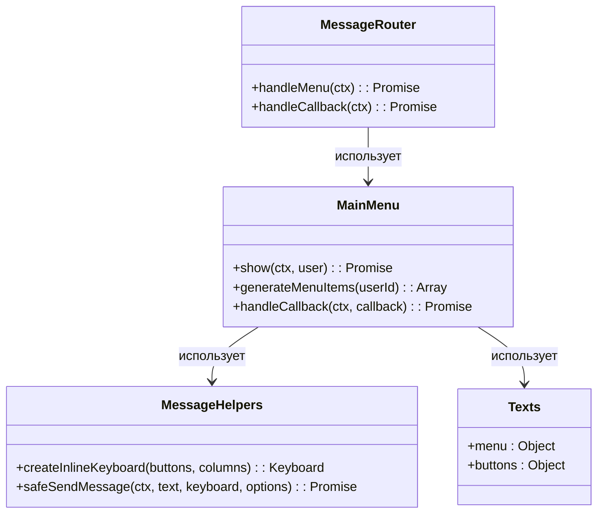
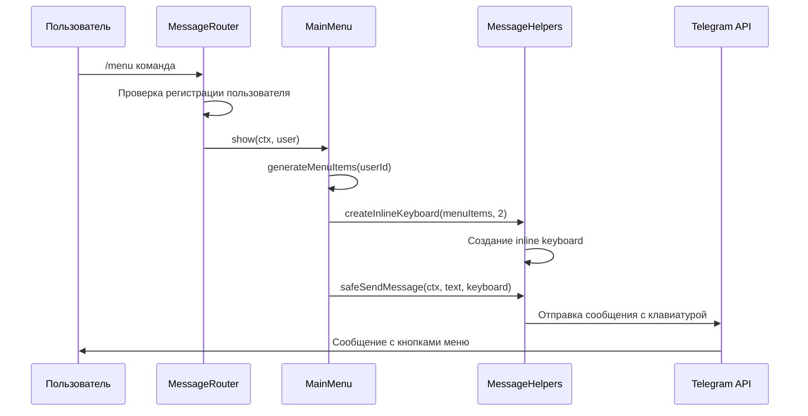
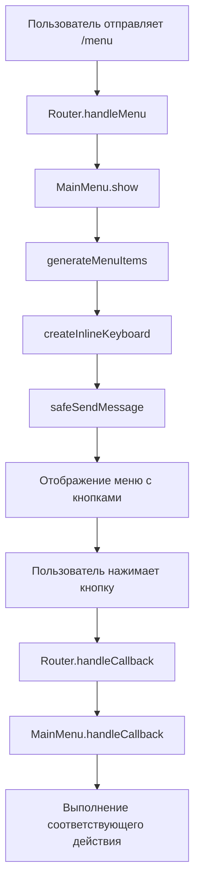

# Исправление функциональности меню

## Обзор

Telegram-бот показывает сообщение "Главное меню Привет, {имя}! Выбери нужную функцию:" при выполнении команды `/menu`, но кнопки меню не отображаются. Необходимо исправить создание и отображение inline-клавиатуры в главном меню.

## Архитектура

### Компоненты системы меню



### Поток обработки команды /menu



## Анализ проблемы

### Выявленные проблемы

1. **Несоответствие структуры кнопок**: В `generateMenuItems()` возвращается массив объектов с полями `{ text, callback }`, а `createInlineKeyboard()` ожидает `{ text, callback_data }`

2. **Неправильная структура данных**: Функция `createInlineKeyboard()` корректно обрабатывает объекты с полем `callback_data`, но `generateMenuItems()` возвращает поле `callback`

3. **Отсутствие обработки ошибок**: Нет проверки корректности создания клавиатуры

### Структура данных

**Текущая (неправильная) структура из `generateMenuItems()`:**

```javascript
{ text: "📅 Предстоящие события", callback: "upcoming_events" }
```

**Ожидаемая структура для `createInlineKeyboard()`:**

```javascript
{ text: "📅 Предстоящие события", callback_data: "upcoming_events" }
```

## Техническое решение

### Исправление структуры кнопок

Изменить метод `generateMenuItems()` в классе `MainMenu` для использования правильного поля `callback_data`:

```javascript
generateMenuItems(userId) {
  const isAdmin = this.adminLogic.isAdmin(userId);

  const menuItems = [
    { text: texts.menu.buttons.changeAttendance, callback_data: 'change_attendance' },
    { text: texts.menu.buttons.eventDetails, callback_data: 'event_details' },
    { text: texts.menu.buttons.usefulInfo, callback_data: 'useful_info' },
    { text: texts.menu.buttons.upcomingEvents, callback_data: 'upcoming_events' },
    { text: texts.menu.buttons.help, callback_data: 'help' }
  ];

  if (isAdmin) {
    menuItems.splice(3, 0, {
      text: texts.menu.buttons.adminGuestList,
      callback_data: 'admin_guest_list'
    });
  }

  return menuItems;
}
```

### Улучшение обработки ошибок

Добавить проверку корректности создания клавиатуры в методе `show()`:

```javascript
async show(ctx, user = null) {
  try {
    const userName = user ? user.full_name : (ctx.from.first_name || 'Пользователь');
    const userId = ctx.from.id.toString();

    const menuText = `${texts.menu.title}\n\nПривет, ${userName}! ${texts.menu.description}`;

    const menuItems = this.generateMenuItems(userId);

    // Проверка корректности данных кнопок
    if (!Array.isArray(menuItems) || menuItems.length === 0) {
      console.error('❌ Ошибка: пустой массив кнопок меню');
      await safeSendMessage(ctx, texts.errors.general);
      return { success: false, error: 'Empty menu items' };
    }

    const keyboard = createInlineKeyboard(menuItems, 2);

    // Дополнительная проверка созданной клавиатуры
    if (!keyboard) {
      console.error('❌ Ошибка создания клавиатуры');
      await safeSendMessage(ctx, texts.errors.general);
      return { success: false, error: 'Keyboard creation failed' };
    }

    await safeSendMessage(ctx, menuText, keyboard, { parseMode: 'HTML' });

    return { success: true };
  } catch (error) {
    console.error('❌ Ошибка отображения главного меню:', error.message);
    await safeSendMessage(ctx, texts.errors.general);
    return { success: false, error: error.message };
  }
}
```

### Улучшение функции createInlineKeyboard

Добавить дополнительные проверки в `createInlineKeyboard()` для лучшей диагностики:

```javascript
function createInlineKeyboard(buttons, columns = 2) {
  if (!Array.isArray(buttons) || buttons.length === 0) {
    console.warn("⚠️ Предупреждение: пустой массив кнопок для клавиатуры")
    return Markup.inlineKeyboard([])
  }

  const rows = []
  for (let i = 0; i < buttons.length; i += columns) {
    const row = buttons
      .slice(i, i + columns)
      .map((button) => {
        if (typeof button === "string") {
          return Markup.button.callback(button, button)
        }

        // Проверка наличия необходимых полей
        if (!button.text) {
          console.error("❌ Ошибка: отсутствует поле text в кнопке:", button)
          return null
        }

        const callbackData =
          button.callback_data || button.callback || button.text

        return Markup.button.callback(button.text, callbackData)
      })
      .filter(Boolean) // Убираем null значения

    if (row.length > 0) {
      rows.push(row)
    }
  }

  return Markup.inlineKeyboard(rows)
}
```

## Диагностика и тестирование

### Добавление логирования

Для диагностики проблем добавить расширенное логирование:

```javascript
async show(ctx, user = null) {
  try {
    console.log(`📋 Генерация меню для пользователя ${ctx.from.id}`);

    const menuItems = this.generateMenuItems(userId);
    console.log('📋 Сгенерированные пункты меню:',
      menuItems.map(item => ({ text: item.text, callback: item.callback_data || item.callback }))
    );

    const keyboard = createInlineKeyboard(menuItems, 2);
    console.log('⌨️ Создана клавиатура:', keyboard ? 'успешно' : 'ошибка');

    // ... остальной код
  } catch (error) {
    // ... обработка ошибок
  }
}
```

### Интеграционное тестирование

Создать тест для проверки генерации меню:

```javascript
// test-menu-generation.js
async function testMenuGeneration() {
  console.log("🧪 Тестирование генерации меню...")

  try {
    const mainMenu = new MainMenu(database)

    // Тест для обычного пользователя
    const regularUserItems = mainMenu.generateMenuItems("123456789")
    console.log("👤 Обычный пользователь - кнопки:", regularUserItems.length)

    // Тест для администратора
    const adminItems = mainMenu.generateMenuItems(process.env.ADMIN_ID)
    console.log("👑 Администратор - кнопки:", adminItems.length)

    // Проверка структуры кнопок
    regularUserItems.forEach((item, index) => {
      if (!item.text || (!item.callback_data && !item.callback)) {
        console.error(`❌ Ошибка в кнопке ${index}:`, item)
      }
    })

    console.log("✅ Тест генерации меню завершен")
  } catch (error) {
    console.error("❌ Ошибка тестирования:", error.message)
  }
}
```

## План исправления

### Этап 1: Исправление структуры данных

1. Изменить `generateMenuItems()` для использования `callback_data` вместо `callback`
2. Добавить проверки корректности данных в `show()`

### Этап 2: Улучшение обработки ошибок

1. Добавить расширенное логирование в `show()` и `createInlineKeyboard()`
2. Улучшить проверки в `createInlineKeyboard()`

### Этап 3: Тестирование и валидация

1. Создать интеграционный тест для генерации меню
2. Протестировать меню для обычных пользователей и администраторов
3. Проверить корректность отображения кнопок

### Этап 4: Финальная проверка

1. Выполнить команду `/menu` в боте
2. Убедиться в отображении всех кнопок
3. Проверить работу callback-обработчиков

## Ожидаемый результат

После исправления:

- Команда `/menu` будет отображать сообщение с корректными inline-кнопками
- Пользователи смогут взаимодействовать с меню через кнопки
- Администраторы увидят дополнительную кнопку управления
- Все callback-запросы будут корректно обрабатываться



Основная проблема заключается в несоответствии полей `callback` и `callback_data` между генератором кнопок и функцией создания клавиатуры. После исправления этого несоответствия меню будет работать корректно.
