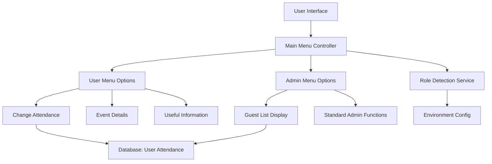
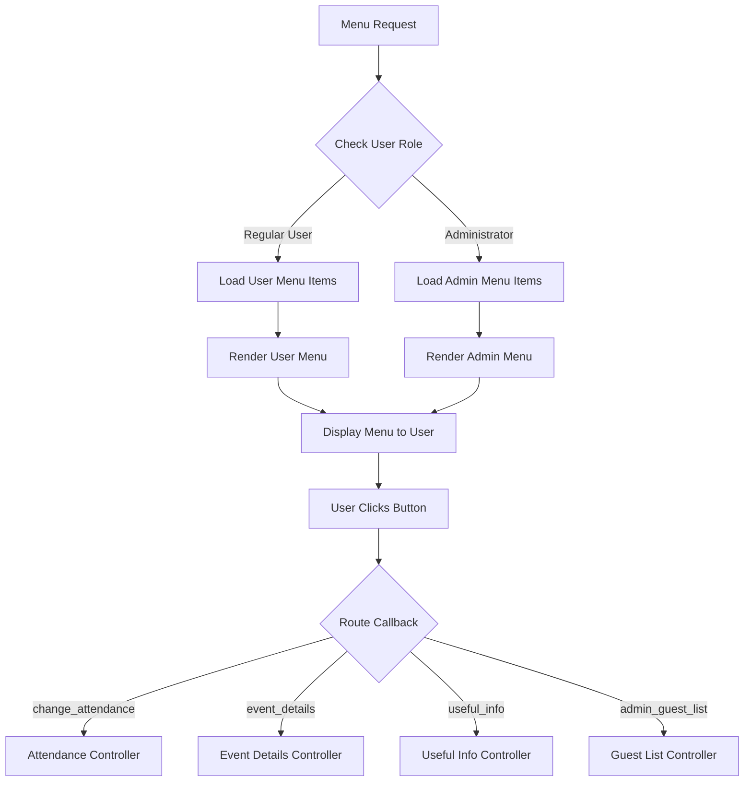
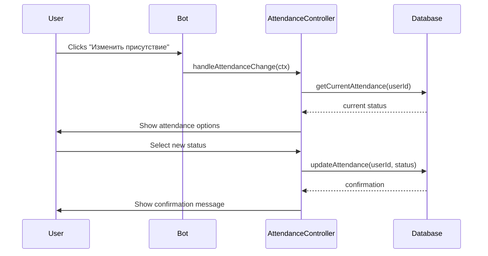

# Дизайн реализации кнопок меню

## Обзор

Данный документ описывает реализацию улучшенных кнопок меню для системы Telegram-бота оповещений о событиях. Улучшение включает новые пользовательские опции меню для управления присутствием и информации о событиях, а также административный функционал для управления списком гостей.

**Ключевые особенности:**

- Улучшенное пользовательское меню с контролем присутствия и информацией о событиях
- Административное управление списком гостей с визуализацией присутствия
- Расширение схемы базы данных для отслеживания присутствия
- Ролевая дифференциация меню между пользователями и администраторами

## Архитектура

### Структура компонентов



### Расширения схемы базы данных

Существующая схема базы данных требует модификации для поддержки отслеживания присутствия:

```sql
-- Добавление колонки присутствия в таблицу пользователей
ALTER TABLE users ADD COLUMN attendance_status TEXT DEFAULT 'attending'
    CHECK (attendance_status IN ('attending', 'not_attending', 'maybe'));

-- Добавление отслеживания времени изменения присутствия
ALTER TABLE users ADD COLUMN attendance_updated_at DATETIME DEFAULT CURRENT_TIMESTAMP;

-- Индекс для эффективных запросов по присутствию
CREATE INDEX IF NOT EXISTS idx_users_attendance ON users(attendance_status);
```

## Архитектура кнопок меню

### Структура пользовательского меню

| Текст кнопки                        | Данные callback     | Функция                                       |
| ----------------------------------- | ------------------- | --------------------------------------------- |
| 🎉 Изменить присутствие             | `change_attendance` | Переключение статуса присутствия пользователя |
| 📋 Подробная информация о торжестве | `event_details`     | Отображение подробной информации о событии    |
| 💡 Полезная информация              | `useful_info`       | Показать полезную информацию о событии        |
| 📅 Предстоящие события              | `upcoming_events`   | Существующий функционал                       |
| ❓ Помощь                           | `help`              | Существующий функционал                       |

### Структура административного меню

| Текст кнопки                        | Данные callback     | Функция                           |
| ----------------------------------- | ------------------- | --------------------------------- |
| 👥 Отобразить список гостей         | `admin_guest_list`  | Показать обзор присутствия гостей |
| 🎉 Изменить присутствие             | `change_attendance` | Аналогично пользовательскому меню |
| 📋 Подробная информация о торжестве | `event_details`     | Аналогично пользовательскому меню |
| 💡 Полезная информация              | `useful_info`       | Аналогично пользовательскому меню |
| 📅 Предстоящие события              | `upcoming_events`   | Существующий функционал           |
| ❓ Помощь                           | `help`              | Существующий функционал           |

### Логика отрисовки меню



## Детали реализации функций

### 1. Система управления присутствием

**Поток присутствия пользователя:**



**Варианты статуса присутствия:**

- ✅ Буду присутствовать (attending)
- ❌ Не смогу присутствовать (not_attending)
- 🤔 Возможно присутствую (maybe)

### 2. Отображение деталей события

**Структура информации:**

- Название и описание события
- Детали даты и времени
- Информация о местоположении
- Требования к дресс-коду
- Контактная информация
- Специальные инструкции

### 3. Отображение полезной информации

**Категории контента:**

- Варианты транспорта
- Информация о парковке
- Предложения по размещению
- Местные достопримечательности
- Экстренные контакты
- Погодные условия

### 4. Административное управление списком гостей

**Формат отображения списка гостей:**

```
👥 Список гостей (Всего: 25)

✅ Присутствуют (18):
• Иван Петров
• Мария Сидорова
• Александр Козлов
...

❌ Не присутствуют (4):
• Анна Волкова
• Петр Кузнецов
...

🤔 Возможно присутствуют (3):
• Елена Морозова
• Дмитрий Лебедев
...
```

**Административные элементы управления:**

- Пагинация для больших списков гостей
- Фильтрация по статусу присутствия
- Функциональность экспорта списка гостей
- Индивидуальное управление гостями

## Расширения управления текстом

### Новые текстовые записи для texts.js

```javascript
// Тексты кнопок меню
menu: {
  buttons: {
    changeAttendance: "🎉 Изменить присутствие",
    eventDetails: "📋 Подробная информация о торжестве",
    usefulInfo: "💡 Полезная информация",
    adminGuestList: "👥 Отобразить список гостей"
  }
},

// Управление присутствием
attendance: {
  title: "🎉 Управление присутствием",
  currentStatus: "Текущий статус: {status}",
  changePrompt: "Выберите ваш статус присутствия:",
  confirmChange: "✅ Статус изменен на: {status}",
  options: {
    attending: "✅ Буду присутствовать",
    notAttending: "❌ Не смогу присутствовать",
    maybe: "🤔 Возможно присутствую"
  }
},

// Детали события
eventDetails: {
  title: "📋 Подробная информация о торжестве",
  content: "Здесь будет подробная информация о событии..."
},

// Полезная информация
usefulInfo: {
  title: "💡 Полезная информация",
  content: "Здесь будет полезная информация для гостей..."
},

// Административный список гостей
admin: {
  guestList: {
    title: "👥 Список гостей",
    total: "Всего гостей: {count}",
    attending: "✅ Присутствуют ({count}):",
    notAttending: "❌ Не присутствуют ({count}):",
    maybe: "🤔 Возможно присутствуют ({count}):",
    noGuests: "📭 Список гостей пуст",
    loadError: "❌ Ошибка загрузки списка гостей"
  }
}
```

## Структура реализации компонентов

### 1. Улучшение класса MainMenu

**Файл:** `interface/main-menu.js`

**Ключевые методы:**

- `generateMenuItems(isAdmin)` - Создание элементов меню на основе роли пользователя
- `handleAttendanceCallback(ctx)` - Обработка запросов на изменение присутствия
- `handleEventDetailsCallback(ctx)` - Отображение деталей события
- `handleUsefulInfoCallback(ctx)` - Отображение полезной информации
- `handleAdminGuestListCallback(ctx)` - Административное отображение списка гостей

### 2. Новый AttendanceController

**Файл:** `features/attendance/logic.js`

**Обязанности:**

- Управление изменениями статуса присутствия пользователя
- Валидация переходов присутствия
- Хранение истории присутствия
- Генерация статистики присутствия

### 3. Новый EventInfoController

**Файл:** `features/event-info/logic.js`

**Обязанности:**

- Предоставление контента с деталями события
- Управление контентом полезной информации
- Обработка обновлений контента
- Поддержка доставки мультимедийного контента

### 4. Улучшенный AdminController

**Файл:** `features/admin/logic.js`

**Обязанности:**

- Генерация списков гостей со статусом присутствия
- Поддержка фильтрации и пагинации списка гостей
- Предоставление интерфейса управления гостями
- Генерация отчетов о присутствии

## Операции с базой данных

### Запросы управления присутствием

```sql
-- Получение статуса присутствия пользователя
SELECT attendance_status, attendance_updated_at
FROM users
WHERE telegram_id = ?;

-- Обновление присутствия пользователя
UPDATE users
SET attendance_status = ?,
    attendance_updated_at = CURRENT_TIMESTAMP
WHERE telegram_id = ?;

-- Получение статистики присутствия
SELECT
    attendance_status,
    COUNT(*) as count
FROM users
GROUP BY attendance_status;

-- Получение списка гостей с присутствием
SELECT
    full_name,
    attendance_status,
    attendance_updated_at
FROM users
ORDER BY attendance_status, full_name;
```

## Соображения безопасности

### Валидация административной роли

```javascript
// Улучшенная проверка администратора
function isAdmin(userId) {
  const adminId = process.env.ADMIN_ID
  const adminIds = process.env.ADMIN_IDS?.split(",") || []

  return userId === adminId || adminIds.includes(userId)
}

// Безопасная обработка callback
async function validateAdminCallback(ctx, callback) {
  if (callback.startsWith("admin_") && !isAdmin(ctx.from.id)) {
    await ctx.answerCbQuery("❌ Недостаточно прав доступа")
    throw new Error("Unauthorized admin action attempt")
  }
}
```

### Защита конфиденциальности данных

- Информация о присутствии видна только пользователю и администраторам
- Доступ к списку гостей ограничен проверенными администраторами
- Отсутствие конфиденциальной личной информации в данных callback
- Безопасное логирование изменений присутствия

## Стратегия тестирования

### Требования к модульному тестированию

**Тесты управления присутствием:**

- Переходы статуса присутствия
- Операции обновления базы данных
- Валидация опций присутствия
- Обработка ошибок для недопустимых состояний

**Тесты генерации меню:**

- Ролевая отрисовка меню
- Генерация данных callback кнопок
- Валидация макета меню
- Проверка локализации

**Тесты административного функционала:**

- Точность генерации списка гостей
- Принуждение контроля доступа
- Функциональность пагинации
- Консистентность форматирования данных

### Сценарии интеграционного тестирования

1. **Поток присутствия пользователя:** Полный рабочий процесс изменения присутствия
2. **Административный список гостей:** Полное отображение и управление списком гостей
3. **Навигация по меню:** Тестирование перекрестной навигации по меню
4. **Консистентность базы данных:** Проверка целостности данных о присутствии
5. **Ролевые разрешения:** Тестирование доступа администратора против пользователя

## Соображения производительности

### Оптимизация базы данных

- Индекс на `attendance_status` для эффективной фильтрации
- Оптимизированные запросы списка гостей с LIMIT/OFFSET для пагинации
- Кэшированная статистика присутствия для административной панели
- Эффективные операции JOIN для генерации списка гостей

### Управление памятью

- Пагинированное отображение списка гостей для предотвращения переполнения памяти
- Ленивая загрузка деталей события и контента полезной информации
- Эффективная маршрутизация callback без ненужной загрузки данных
- Оптимизированная отрисовка текстовых шаблонов

## Обработка ошибок

### Ошибки управления присутствием

```javascript
try {
  await updateAttendance(userId, newStatus)
} catch (error) {
  if (error.code === "CONSTRAINT_ERROR") {
    await ctx.reply("❌ Недопустимый статус присутствия")
  } else if (error.code === "USER_NOT_FOUND") {
    await ctx.reply("❌ Пользователь не найден")
  } else {
    await ctx.reply("❌ Ошибка изменения статуса. Попробуйте позже.")
  }
}
```

### Ошибки административных функций

- Грациозная обработка больших списков гостей
- Защита от таймаутов для запросов к базе данных
- Резервные сообщения для сбоев загрузки данных
- Уведомление администратора о системных ошибках
