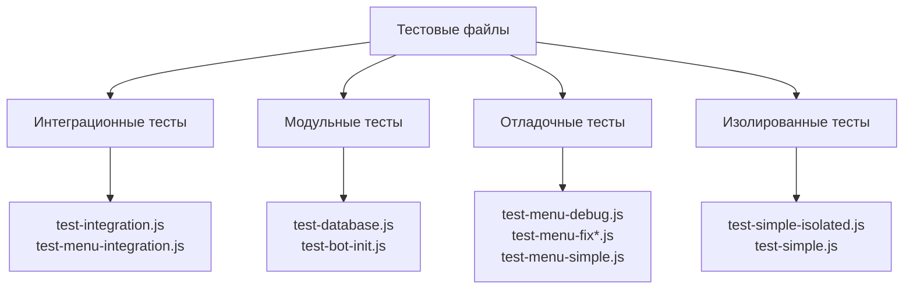

# Перемещение тестовых файлов в отдельную директорию

## Обзор

Цель данной задачи - организовать структуру проекта путем перемещения всех тестовых файлов из корневой директории в отдельную папку `tests/` и настройки системы для автоматического создания будущих тестовых файлов в этой директории.

### Текущее состояние

В корневой директории проекта находятся следующие тестовые файлы:

- `test-bot-init.js`
- `test-database.js`
- `test-integration.js`
- `test-menu-debug.js`
- `test-menu-fix-final.js`
- `test-menu-fix.js`
- `test-menu-integration.js`
- `test-menu-simple.js`
- `test-simple-isolated.js`
- `test-simple.js`

### Целевое состояние

Все тестовые файлы должны быть перемещены в директорию `tests/` с сохранением их функциональности и обеспечением автоматического создания новых тестов в этой папке.

## Архитектура решения

### Структура директорий

```
tests/
├── integration/          # Интеграционные тесты
│   ├── test-integration.js
│   └── test-menu-integration.js
├── unit/                # Модульные тесты
│   ├── test-database.js
│   └── test-bot-init.js
├── debug/               # Отладочные тесты
│   ├── test-menu-debug.js
│   ├── test-menu-fix.js
│   ├── test-menu-fix-final.js
│   └── test-menu-simple.js
├── isolated/            # Изолированные тесты
│   ├── test-simple-isolated.js
│   └── test-simple.js
└── config/              # Конфигурация тестов
    ├── jest.config.js
    └── test-setup.js
```

### Категоризация тестов



## Детальный план реализации

### Этап 1: Создание структуры директорий

1. Создать главную директорию `tests/` в корне проекта
2. Создать поддиректории для разных типов тестов:
   - `tests/integration/` - для интеграционных тестов
   - `tests/unit/` - для модульных тестов
   - `tests/debug/` - для отладочных тестов
   - `tests/isolated/` - для изолированных тестов
   - `tests/config/` - для конфигурации тестирования

### Этап 2: Перемещение файлов по категориям

#### Интеграционные тесты

- `test-integration.js` → `tests/integration/`
- `test-menu-integration.js` → `tests/integration/`

#### Модульные тесты

- `test-database.js` → `tests/unit/`
- `test-bot-init.js` → `tests/unit/`

#### Отладочные тесты

- `test-menu-debug.js` → `tests/debug/`
- `test-menu-fix.js` → `tests/debug/`
- `test-menu-fix-final.js` → `tests/debug/`
- `test-menu-simple.js` → `tests/debug/`

#### Изолированные тесты

- `test-simple-isolated.js` → `tests/isolated/`
- `test-simple.js` → `tests/isolated/`

### Этап 3: Обновление путей импорта

Для каждого перемещенного файла необходимо:

1. **Обновить относительные пути импорта**:

   ```javascript
   // Старый путь в корне
   const { createUser } = require("./features/onboarding/logic")

   // Новый путь из tests/unit/
   const { createUser } = require("../../features/onboarding/logic")
   ```

2. **Обновить пути к базе данных**:

   ```javascript
   // Старый путь
   const dbPath = "./test_database.db"

   // Новый путь
   const dbPath = "../../test_database.db"
   ```

### Этап 4: Обновление package.json

Модификация скриптов тестирования для работы с новой структурой:

```json
{
  "scripts": {
    "test": "jest tests/",
    "test:unit": "jest tests/unit/",
    "test:integration": "jest tests/integration/",
    "test:debug": "jest tests/debug/",
    "test:isolated": "jest tests/isolated/",
    "test:watch": "jest tests/ --watch",
    "test:coverage": "jest tests/ --coverage"
  }
}
```

### Этап 5: Настройка Jest конфигурации

Создание `tests/config/jest.config.js`:

```javascript
module.exports = {
  testEnvironment: "node",
  roots: ["<rootDir>/tests"],
  testMatch: ["**/tests/**/*.test.js", "**/tests/**/test-*.js"],
  collectCoverageFrom: [
    "bot/**/*.js",
    "features/**/*.js",
    "utils/**/*.js",
    "database/**/*.js",
    "interface/**/*.js",
    "!**/node_modules/**",
  ],
  coverageDirectory: "coverage",
  coverageReporters: ["text", "lcov", "html"],
}
```

### Этап 6: Обновление .gitignore

Добавление правил для игнорирования временных тестовых файлов:

```gitignore
# Тестовые базы данных
tests/**/*.db
tests/**/*.sqlite
tests/**/*.sqlite3

# Покрытие тестов
coverage/
.coverage/

# Временные тестовые файлы
tests/tmp/
tests/temp/
```

## Автоматизация создания тестов

### Шаблоны для новых тестов

Создание шаблонов в `tests/config/templates/`:

#### Шаблон модульного теста

```javascript
// tests/config/templates/unit-test.template.js
const path = require("path")

// Базовые импорты для модульных тестов
// const moduleToTest = require('../../path/to/module');

describe("MODULE_NAME Unit Tests", () => {
  beforeEach(() => {
    // Настройка перед каждым тестом
  })

  afterEach(() => {
    // Очистка после каждого теста
  })

  test("should test basic functionality", () => {
    // Тест базовой функциональности
    expect(true).toBe(true)
  })
})
```

#### Шаблон интеграционного теста

```javascript
// tests/config/templates/integration-test.template.js
const Database = require("better-sqlite3")
const path = require("path")

describe("FEATURE_NAME Integration Tests", () => {
  let db

  beforeAll(() => {
    // Создание тестовой базы данных
    const dbPath = path.join(__dirname, "../tmp/test_integration.db")
    db = new Database(dbPath)

    // Инициализация схемы
  })

  afterAll(() => {
    // Закрытие и удаление тестовой базы данных
    if (db) {
      db.close()
    }
  })

  test("should test integration flow", () => {
    // Тест интеграционного потока
    expect(true).toBe(true)
  })
})
```

### CLI скрипт для создания тестов

Создание `tests/config/create-test.js`:

```javascript
#!/usr/bin/env node

const fs = require("fs")
const path = require("path")

function createTest(type, name) {
  const templatePath = path.join(
    __dirname,
    "templates",
    `${type}-test.template.js`
  )
  const testDir = path.join(__dirname, "..", type)
  const testPath = path.join(testDir, `test-${name}.js`)

  // Убедимся что директория существует
  if (!fs.existsSync(testDir)) {
    fs.mkdirSync(testDir, { recursive: true })
  }

  // Читаем шаблон и заменяем плейсхолдеры
  let template = fs.readFileSync(templatePath, "utf8")
  template = template.replace(/MODULE_NAME/g, name)
  template = template.replace(/FEATURE_NAME/g, name)

  // Записываем новый тест
  fs.writeFileSync(testPath, template)

  console.log(`Создан тест: ${testPath}`)
}

// Использование: node create-test.js unit database-connection
const [, , type, name] = process.argv

if (!type || !name) {
  console.log("Использование: node create-test.js <type> <name>")
  console.log("Типы: unit, integration, debug, isolated")
  process.exit(1)
}

createTest(type, name)
```

### Обновление package.json для CLI

Добавление скрипта создания тестов:

```json
{
  "scripts": {
    "create-test": "node tests/config/create-test.js"
  }
}
```

## Обновление документации

### Изменение README.md

Обновление секции тестирования:

````markdown
## Тестирование

### Структура тестов

- `tests/unit/` - Модульные тесты отдельных функций и модулей
- `tests/integration/` - Интеграционные тесты взаимодействия компонентов
- `tests/debug/` - Отладочные тесты для диагностики проблем
- `tests/isolated/` - Изолированные тесты компонентов

### Запуск тестов

```bash
# Все тесты
npm test

# По типу
npm run test:unit
npm run test:integration

# С отслеживанием изменений
npm run test:watch

# С покрытием кода
npm run test:coverage
```
````

### Создание новых тестов

```bash
# Создание модульного теста
npm run create-test unit feature-name

# Создание интеграционного теста
npm run create-test integration workflow-name
```

````

### Обновление tgbot.md

Модификация правил проекта:

```markdown
## **Тестирование**

### **Структура тестов**
- Все тесты размещаются в директории `tests/`
- Подкатегории: `unit/`, `integration/`, `debug/`, `isolated/`
- Новые тесты создаются через `npm run create-test`

### **Правила именования**
- Префикс `test-` для всех тестовых файлов
- Размещение только в директории `tests/` и подпапках
- Использование шаблонов для консистентности

### **Скрипты запуска**
- `npm test` - все тесты
- `npm run test:unit` - модульные тесты
- `npm run test:integration` - интеграционные тесты
````

## Проверка и валидация

### Контрольный список

1. **Структура директорий**:

   - ✅ Создана директория `tests/` с подпапками
   - ✅ Все файлы перемещены в соответствующие категории

2. **Функциональность**:

   - ✅ Все тесты запускаются без ошибок
   - ✅ Пути импорта корректно обновлены
   - ✅ База данных создается в правильном месте

3. **Автоматизация**:

   - ✅ Jest настроен для работы с новой структурой
   - ✅ CLI скрипт создания тестов функционирует
   - ✅ Шаблоны тестов готовы к использованию

4. **Документация**:
   - ✅ README.md обновлен с новыми инструкциями
   - ✅ tgbot.md содержит обновленные правила
   - ✅ Примеры использования добавлены

### Команды для проверки

```bash
# Проверка структуры
ls -la tests/

# Запуск всех тестов
npm test

# Проверка конкретной категории
npm run test:unit

# Создание тестового теста
npm run create-test unit sample

# Проверка покрытия
npm run test:coverage
```

## Преимущества решения

### Организация кода

- **Четкая структура**: Логическое разделение по типам тестов
- **Масштабируемость**: Легко добавлять новые категории тестов
- **Читаемость**: Понятная иерархия файлов

### Процесс разработки

- **Автоматизация**: Шаблоны и CLI для создания тестов
- **Консистентность**: Единообразный подход к тестированию
- **Эффективность**: Быстрый поиск и запуск нужных тестов

### Поддержка и сопровождение

- **Изоляция**: Тестовые файлы не засоряют корневую директорию
- **Конфигурируемость**: Централизованные настройки Jest
- **Расширяемость**: Простое добавление новых типов тестов

Данное решение обеспечивает чистую организацию тестовых файлов и создает основу для масштабируемой системы тестирования в проекте.
