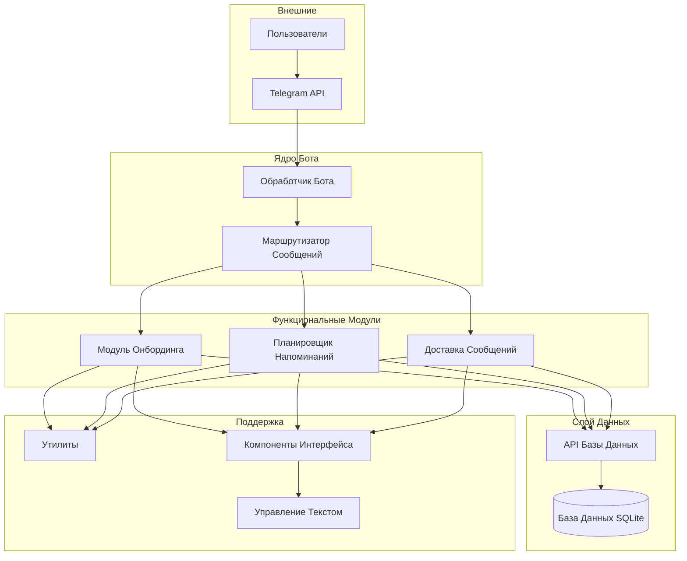
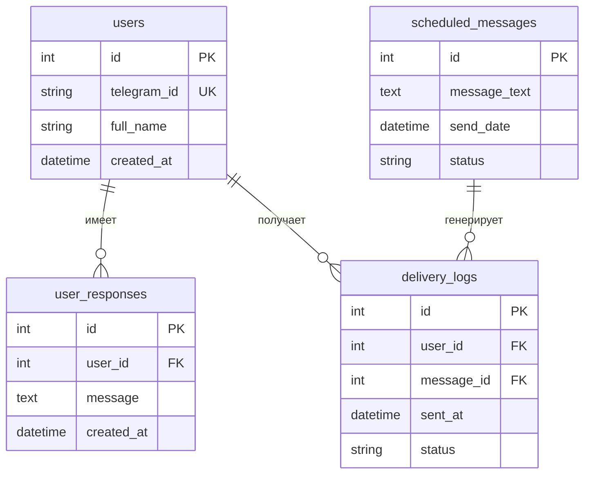
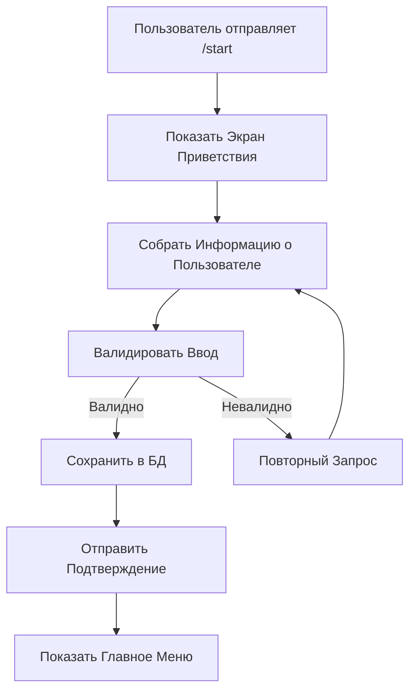
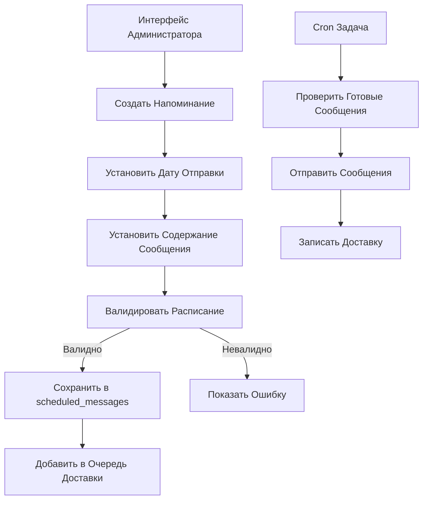
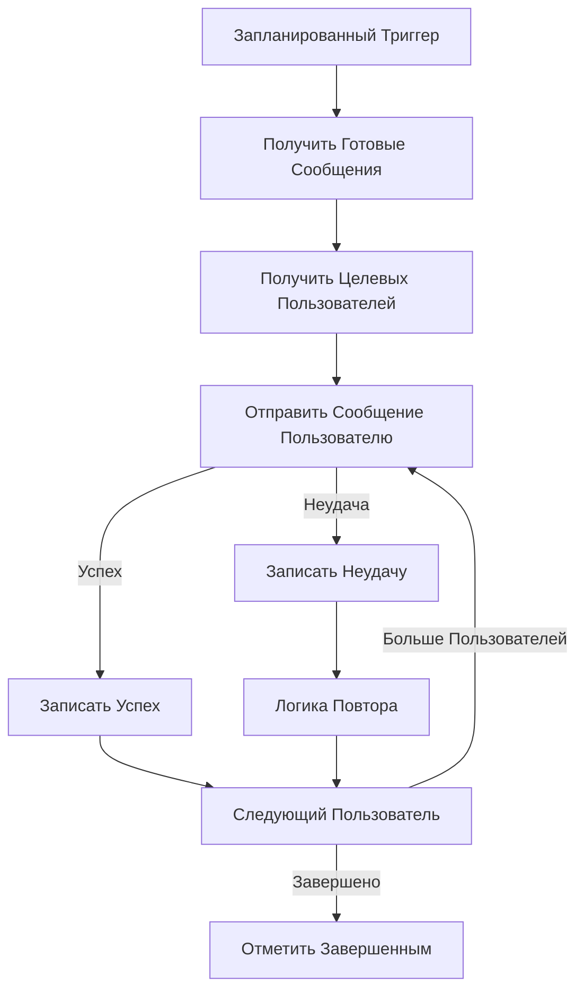
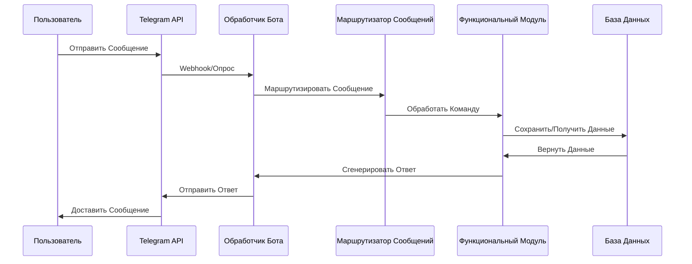
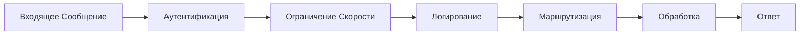
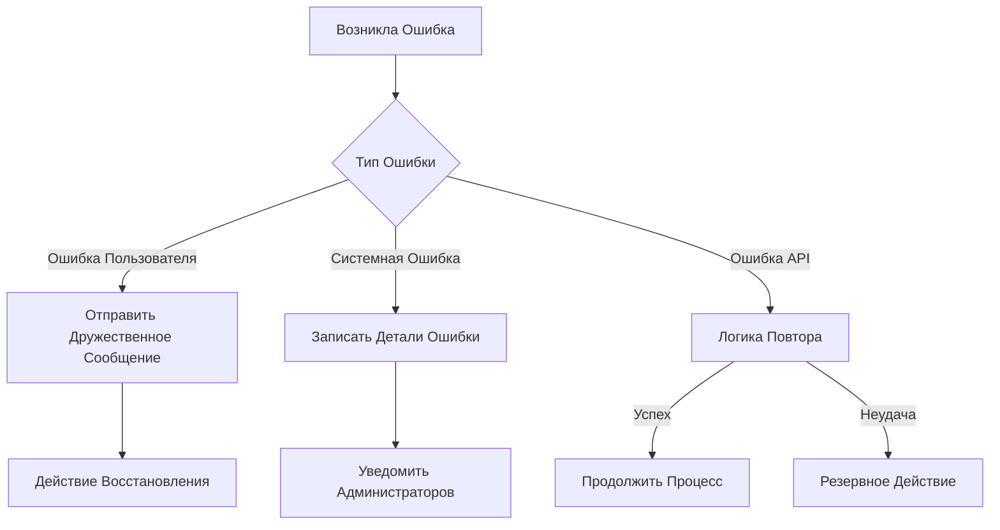
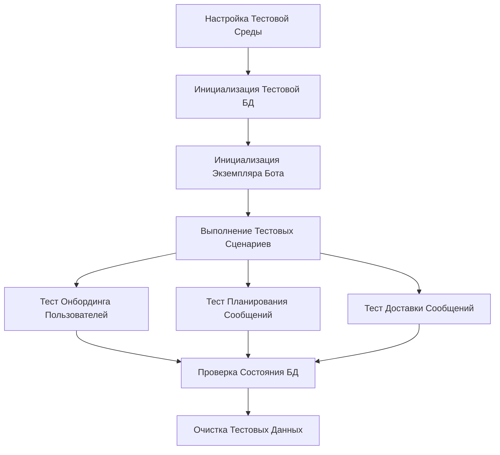

# Дизайн Системы Telegram Бота для Напоминаний о Событиях

## Обзор

Telegram бот для напоминаний о событиях - это модульное backend приложение, предназначенное для управления объявлениями о событиях и сбора ответов пользователей через платформу Telegram. Система планирует и доставляет напоминания, отслеживая вовлеченность пользователей и шаблоны ответов.

**Основная цель**: Автоматизация коммуникации о событиях и отслеживание ответов участников через интерфейс Telegram

**Ключевые функции**:

- Онбординг пользователей и сбор ответов
- Планируемая доставка сообщений
- Управление напоминаниями о событиях
- Отслеживание ответов и аналитика

## Архитектура

### Системная Архитектура



### Структура Директорий

```
tg-bot-announcer-3/
├── bot/
│   ├── index.js              # Инициализация и запуск бота
│   ├── router.js             # Логика маршрутизации сообщений
│   └── texts.js              # Централизованное управление текстом
├── database/
│   ├── schema.sql            # Определение схемы базы данных
│   ├── connection.js         # Настройка подключения к БД
│   └── migrations/           # Управление версиями БД
├── features/
│   ├── onboarding/
│   │   ├── logic.js          # Приветствие и регистрация пользователей
│   │   └── api.js            # Операции с данными онбординга
│   ├── reminder-scheduler/
│   │   ├── logic.js          # Управление расписанием
│   │   └── api.js            # Операции с данными планирования
│   └── message-delivery/
│       ├── logic.js          # Логика отправки сообщений
│       └── api.js            # Операции отслеживания доставки
├── interface/
│   ├── main-menu.js          # Основной интерфейс навигации
│   ├── welcome-screen.js     # Начальный пользовательский опыт
│   ├── user-response.js      # Интерфейс сбора ответов
│   └── upcoming-events.js    # Интерфейс отображения событий
├── utils/
│   ├── date-utils.js         # Функции манипуляции с датами
│   ├── format-utils.js       # Утилиты форматирования текста
│   ├── db-utils.js           # Вспомогательные функции БД
│   └── message-helpers.js    # Утилиты конструирования сообщений
└── docs/
    ├── README.ru.md          # Русская документация
    └── README.md             # Английская документация
```

## Модели Данных и Схема Базы Данных

### Диаграмма Связей Сущностей



### Детали Схемы Базы Данных

**Основные Таблицы**:

- `users`: Хранение информации о пользователях Telegram и данных регистрации
- `user_responses`: Отслеживание всех ответов и взаимодействий пользователей
- `scheduled_messages`: Управление очередью доставки будущих сообщений
- `delivery_logs`: Мониторинг статуса доставки сообщений и аналитика

**Ключевые Индексы**:

```sql
CREATE INDEX idx_user_responses_user ON user_responses(user_id);
CREATE INDEX idx_scheduled_messages_date ON scheduled_messages(send_date);
CREATE INDEX idx_delivery_logs_user_message ON delivery_logs(user_id, message_id);
CREATE INDEX idx_users_telegram_id ON users(telegram_id);
```

**Связи**:

- Пользователи могут иметь множество ответов (1:N)
- Пользователи могут получать множество доставок (1:N)
- Запланированные сообщения могут иметь множество попыток доставки (1:N)
- Все внешние ключи используют CASCADE удаление для согласованности данных

## Слой Бизнес-Логики

### Архитектура Модуля Онбординга



**Ключевые Функции**:

```javascript
// Обработка регистрации нового пользователя
function handleNewUser(ctx) {
  const userId = ctx.from.id
  const username = ctx.from.username || ctx.from.first_name

  return {
    userId,
    username,
    registrationDate: new Date(),
  }
}

// Захват и валидация пользовательского ввода
function collectUserResponse(message) {
  if (!message || message.trim().length === 0) {
    throw new Error("Пустое сообщение")
  }

  return {
    content: message.trim(),
    timestamp: new Date(),
    isValid: true,
  }
}

// Сохранение информации о пользователе в БД
async function storeUserData(userData) {
  const query = `
    INSERT INTO users (telegram_id, full_name, created_at) 
    VALUES (?, ?, ?)
  `

  return await db.run(query, [
    userData.userId,
    userData.username,
    userData.registrationDate,
  ])
}
```

### Архитектура Планировщика Напоминаний



**Ключевые Функции**:

```javascript
// Создание нового запланированного сообщения
async function scheduleReminder(messageData) {
  const query = `
    INSERT INTO scheduled_messages (message_text, send_date, status)
    VALUES (?, ?, 'pending')
  `

  return await db.run(query, [messageData.text, messageData.sendDate])
}

// Обеспечение валидной даты/времени и содержания
function validateSchedule(scheduleData) {
  const now = new Date()
  const sendDate = new Date(scheduleData.sendDate)

  if (sendDate <= now) {
    throw new Error("Дата отправки должна быть в будущем")
  }

  if (!scheduleData.text || scheduleData.text.length === 0) {
    throw new Error("Текст сообщения не может быть пустым")
  }

  return true
}

// Выполнение очереди доставки
async function processScheduledMessages() {
  const query = `
    SELECT * FROM scheduled_messages 
    WHERE send_date <= ? AND status = 'pending'
  `

  const messages = await db.all(query, [new Date()])

  for (const message of messages) {
    await deliverMessage(message)
  }
}
```

### Архитектура Доставки Сообщений



**Ключевые Функции**:

```javascript
// Получение сообщений готовых к доставке
async function fetchDueMessages() {
  const query = `
    SELECT * FROM scheduled_messages 
    WHERE send_date <= ? AND status = 'pending'
    ORDER BY send_date ASC
  `

  return await db.all(query, [new Date()])
}

// Получение списка активных пользователей
async function getTargetUsers() {
  const query = `
    SELECT telegram_id, full_name 
    FROM users 
    WHERE created_at IS NOT NULL
  `

  return await db.all(query)
}

// Отправка индивидуального сообщения через Telegram API
async function deliverMessage(message, user) {
  try {
    await bot.telegram.sendMessage(user.telegram_id, message.message_text)

    await updateDeliveryLog({
      userId: user.telegram_id,
      messageId: message.id,
      status: "delivered",
      sentAt: new Date(),
    })

    return { success: true }
  } catch (error) {
    return handleDeliveryError(error, message, user)
  }
}

// Управление неудачными попытками доставки
async function handleDeliveryError(error, message, user) {
  await updateDeliveryLog({
    userId: user.telegram_id,
    messageId: message.id,
    status: "failed",
    error: error.message,
    sentAt: new Date(),
  })

  return { success: false, error: error.message }
}
```

## Слой Интеграции API

### Интеграция Telegram Bot API



**Точки Интеграции**:

- **Webhooks**: Обработка сообщений в реальном времени
- **Polling**: Альтернативный метод получения сообщений
- **Обработка Ошибок**: Ограничения скорости Telegram API и сбои
- **Типы Сообщений**: Текст, кнопки, встроенные клавиатуры, загрузка файлов

### Подключения Внешних API

Каждый функциональный модуль содержит `api.js` для внешних интеграций:

```javascript
// database/api.js - Операции с Базой Данных
class DatabaseAPI {
  constructor(dbPath) {
    this.db = require("better-sqlite3")(dbPath)
  }

  async createUser(userData) {
    const stmt = this.db.prepare(`
      INSERT INTO users (telegram_id, full_name, created_at)
      VALUES (?, ?, ?)
    `)

    return stmt.run(userData.telegramId, userData.fullName, new Date())
  }

  async getUserByTelegramId(telegramId) {
    const stmt = this.db.prepare("SELECT * FROM users WHERE telegram_id = ?")
    return stmt.get(telegramId)
  }
}

// features/onboarding/api.js - API онбординга
const winston = require("winston")
const logger = winston.createLogger({
  level: "info",
  format: winston.format.json(),
  transports: [
    new winston.transports.File({ filename: "logs/onboarding.log" }),
  ],
})

class OnboardingAPI {
  constructor(dbApi, botApi) {
    this.db = dbApi
    this.bot = botApi
  }

  async processNewUser(ctx) {
    try {
      const userData = {
        telegramId: ctx.from.id,
        fullName: ctx.from.first_name || ctx.from.username,
      }

      await this.db.createUser(userData)

      logger.info("Новый пользователь зарегистрирован", {
        userId: userData.telegramId,
        name: userData.fullName,
      })

      return { success: true, user: userData }
    } catch (error) {
      logger.error("Ошибка регистрации пользователя", {
        error: error.message,
        userId: ctx.from.id,
      })

      throw error
    }
  }
}

module.exports = { OnboardingAPI }
```

## Middleware и Перехватчики

### Конвейер Обработки Сообщений



**Компоненты Middleware**:

```javascript
// Middleware Аутентификации
function authMiddleware(ctx, next) {
  const userId = ctx.from?.id

  if (!userId) {
    return ctx.reply("Ошибка аутентификации")
  }

  ctx.userId = userId
  return next()
}

// Ограничение Скорости
const rateLimiter = new Map()

function rateLimitMiddleware(ctx, next) {
  const userId = ctx.userId
  const now = Date.now()
  const userLimit = rateLimiter.get(userId) || {
    count: 0,
    resetTime: now + 60000,
  }

  if (now > userLimit.resetTime) {
    userLimit.count = 0
    userLimit.resetTime = now + 60000
  }

  if (userLimit.count >= 10) {
    return ctx.reply("Слишком много запросов. Попробуйте позже.")
  }

  userLimit.count++
  rateLimiter.set(userId, userLimit)

  return next()
}

// Middleware Логирования
function loggingMiddleware(ctx, next) {
  const start = Date.now()

  console.log(
    `[${new Date().toISOString()}] ${ctx.updateType} from ${ctx.userId}`
  )

  return next().finally(() => {
    const duration = Date.now() - start
    console.log(`[${new Date().toISOString()}] Completed in ${duration}ms`)
  })
}
```

### Стратегия Обработки Ошибок



**Категории Ошибок**:

- **Ошибки Пользовательского Ввода**: Невалидные команды, некорректные данные
- **Системные Ошибки**: Сбои базы данных, проблемы с памятью
- **Ошибки Внешних API**: Сбои Telegram API, сетевые проблемы
- **Ошибки Бизнес-Логики**: Невалидные переходы состояний, нарушения правил

## Стратегия Тестирования

### Фреймворк Модульного Тестирования

**Области Покрытия Тестами**:

- **Утилитарные Функции**: Манипуляции с датами, форматирование, помощники БД
- **Бизнес-Логика**: Онбординг пользователей, планирование, логика доставки
- **Операции с Базой Данных**: CRUD операции, валидация данных
- **Обработка Сообщений**: Парсинг команд, генерация ответов

**Инструменты Тестирования**:

```javascript
// Jest - Основной фреймворк тестирования
describe("Модуль Онбординга", () => {
  test("должен обрабатывать нового пользователя", () => {
    const ctx = {
      from: { id: 12345, username: "testuser" },
    }

    const result = handleNewUser(ctx)

    expect(result.userId).toBe(12345)
    expect(result.username).toBe("testuser")
    expect(result.registrationDate).toBeInstanceOf(Date)
  })
})

// Мокирование Telegram API для интеграционных тестов
const mockBot = {
  telegram: {
    sendMessage: jest.fn().mockResolvedValue({ message_id: 1 }),
  },
}

describe("Доставка Сообщений", () => {
  test("должен отправлять сообщение пользователю", async () => {
    const message = { id: 1, message_text: "Тест" }
    const user = { telegram_id: 12345 }

    const result = await deliverMessage(message, user)

    expect(result.success).toBe(true)
    expect(mockBot.telegram.sendMessage).toHaveBeenCalledWith(12345, "Тест")
  })
})

// SQLite Memory для изоляции тестов
const Database = require("better-sqlite3")
const testDb = new Database(":memory:")

beforeEach(() => {
  testDb.exec(`
    CREATE TABLE IF NOT EXISTS users (
      id INTEGER PRIMARY KEY,
      telegram_id TEXT UNIQUE,
      full_name TEXT,
      created_at DATETIME
    )
  `)
})

afterEach(() => {
  testDb.exec("DROP TABLE IF EXISTS users")
})
```

### Интеграционное Тестирование



**Тестовые Сценарии**:

1. **Поток Онбординга Пользователей**: Регистрация новых пользователей и сбор ответов
2. **Планирование Сообщений**: Создание, валидация и постановка в очередь запланированных сообщений
3. **Процесс Доставки**: Выполнение запланированных доставок и отслеживание результатов
4. **Обработка Ошибок**: Симуляция сбоев и проверка восстановления
5. **Целостность Базы Данных**: Обеспечение согласованности данных и связей

### Управление Тестовыми Данными

**Стратегия Тестовой Базы Данных**:

- Отдельная тестовая база данных с идентичной схемой
- Автоматизированная генерация тестовых данных для реалистичных сценариев
- Откат транзакций для изоляции тестов
- Начальные данные для согласованных тестовых сред

**Тестирование Производительности**:

- Производительность доставки сообщений под нагрузкой
- Валидация оптимизации запросов к базе данных
- Мониторинг использования памяти во время длительной работы
- Возможности обработки одновременных пользователей
