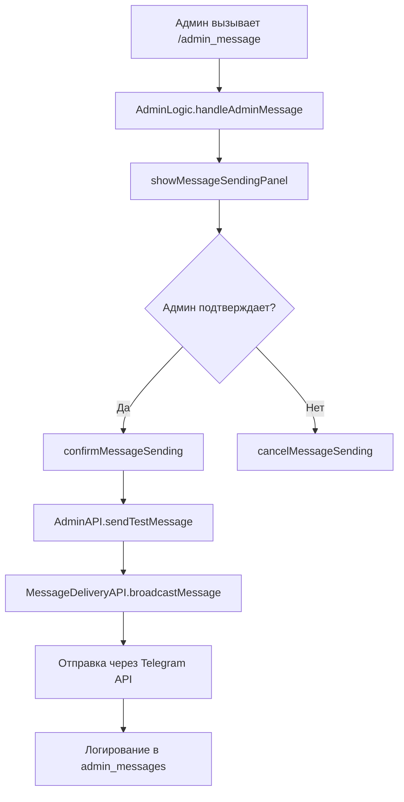
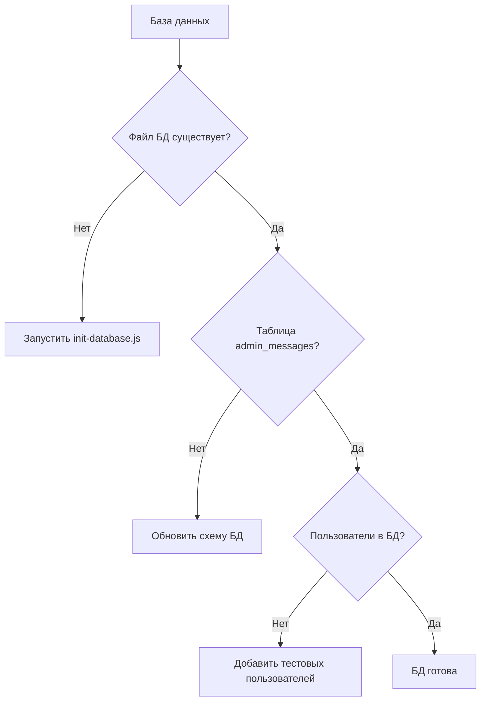

# Техническое задание: Восстановление админской рассылки в Telegram боте

## Обзор проблемы

### Описание проблемы

Функция административной рассылки сообщений в Telegram боте не работает. Администратор не может отправлять тестовые сообщения всем пользователям через интерфейс бота.

### Текущее состояние системы

- ✅ Код админской рассылки реализован в `features/admin/`
- ✅ Интерфейсы и тексты присутствуют
- ✅ Схема БД включает таблицу `admin_messages`
- ❌ Функция не работает (возможные причины ниже)

## Архитектура админской рассылки

### Компоненты системы



### Текущая реализация

#### 1. Точки входа

- **Команда**: `/admin_message` (bot/router.js:110-127)
- **Кнопка меню**: "Отправить тестовое сообщение" (только для админов)
- **Callback**: `admin_send_test_message`

#### 2. Ключевые методы

- `AdminLogic.handleAdminMessage()` - показ панели отправки
- `AdminLogic.confirmMessageSending()` - подтверждение отправки
- `AdminAPI.sendTestMessage()` - основная логика рассылки
- `MessageDeliveryAPI.broadcastMessage()` - механизм доставки

#### 3. База данных

- Таблица `admin_messages` для логирования отправок
- Таблица `users` для получения списка получателей

## Диагностика проблемы

### Возможные причины неработоспособности

#### 1. Проблемы с базой данных



#### 2. Проблемы с правами доступа

- Неправильно настроен `ADMIN_ID` в environment
- Пользователь не определяется как администратор

#### 3. Проблемы с Telegram API

- Неверный `BOT_TOKEN`
- Бот заблокирован пользователями
- Превышены лимиты API

#### 4. Проблемы с кодом

- Ошибки в логике обработки callback'ов
- Проблемы с валидацией бота

## План восстановления

### Этап 1: Диагностика базы данных

```bash
# Проверка существования БД
ls -la database/bot_database.db

# Инициализация БД (если отсутствует)
node init-database.js

# Валидация админской функциональности
node tests/debug/validate-admin-broadcast.js
```

### Этап 2: Проверка конфигурации

```bash
# Проверка переменных окружения
echo $BOT_TOKEN
echo $ADMIN_ID

# Создание .env если отсутствует
cp .env.example .env
# Заполнить BOT_TOKEN и ADMIN_ID
```

### Этап 3: Тестирование компонентов

#### Тест 1: Инициализация компонентов

```javascript
// Проверка создания экземпляров классов
const adminAPI = new AdminAPI(db)
const adminLogic = new AdminLogic(db)
```

#### Тест 2: Проверка прав администратора

```javascript
// Проверка isAdmin() метода
adminLogic.isAdmin(process.env.ADMIN_ID) // должно вернуть true
```

#### Тест 3: Проверка получения пользователей

```javascript
// Тест получения активных пользователей
const users = await adminAPI.getActiveUsers()
console.log("Пользователей:", users.length)
```

#### Тест 4: Тест отправки сообщения

```javascript
// Тест отправки через mockBot
const result = await adminAPI.sendTestMessage(mockBot, adminId)
console.log("Результат:", result)
```

### Этап 4: Интеграционное тестирование

```bash
# Запуск интеграционных тестов
npm test tests/integration/test-admin-message-broadcast.test.js
```

## Исправления и улучшения

### Критические исправления

#### 1. Валидация базы данных при старте

```javascript
// Добавить в bot/index.js
async function validateDatabase() {
  const db = getDatabaseConnection().connect()

  // Проверка существования таблицы admin_messages
  const table = db
    .prepare(
      `
    SELECT name FROM sqlite_master 
    WHERE type='table' AND name='admin_messages'
  `
    )
    .get()

  if (!table) {
    throw new Error("Таблица admin_messages не найдена")
  }
}
```

#### 2. Улучшенная обработка ошибок

```javascript
// В AdminAPI.sendTestMessage()
try {
  const result = await this.messageDeliveryAPI.broadcastMessage(...);
  return result;
} catch (error) {
  console.error('❌ Критическая ошибка рассылки:', error);
  return { success: false, error: error.message };
}
```

#### 3. Добавление логирования отладки

```javascript
// В AdminLogic методах
console.log(
  `🔍 [DEBUG] handleAdminMessage: userId=${userId}, isAdmin=${this.isAdmin(
    userId
  )}`
)
```

### Дополнительные улучшения

#### 1. Индикатор прогресса в реальном времени

```javascript
// Обновление сообщения во время отправки
const onProgress = (stats) => {
  const progressText = texts.admin.message.sending
    .replace("{completed}", stats.completed)
    .replace("{total}", stats.total)
    .replace("{delivered}", stats.delivered)
    .replace("{failed}", stats.failed)

  ctx.editMessageText(progressText, { parse_mode: "HTML" })
}
```

#### 2. История отправок с пагинацией

```javascript
// В AdminAPI
async getTestMessageHistory(page = 1, limit = 10) {
  const offset = (page - 1) * limit;
  // SQL с LIMIT и OFFSET
}
```

#### 3. Фильтрация получателей

```javascript
// Опции для выбора получателей
- Все пользователи
- Только подтвердившие участие
- Только неопределившиеся
- Только отказавшиеся
```

## Проверочный список

### ✅ База данных

- [ ] Файл `database/bot_database.db` существует
- [ ] Таблица `admin_messages` создана
- [ ] В таблице `users` есть записи
- [ ] Схема БД актуальна

### ✅ Конфигурация

- [ ] Переменная `BOT_TOKEN` установлена
- [ ] Переменная `ADMIN_ID` установлена
- [ ] Файл `.env` существует и заполнен

### ✅ Код и интерфейс

- [ ] Команда `/admin_message` работает
- [ ] Кнопка в меню отображается для админа
- [ ] Callback'и обрабатываются корректно
- [ ] Тексты интерфейса загружаются

### ✅ Telegram API

- [ ] Бот отвечает на команды
- [ ] Валидация токена проходит успешно
- [ ] Отправка сообщений работает

### ✅ Тестирование

- [ ] Интеграционные тесты проходят
- [ ] Отладочный скрипт выполняется без ошибок
- [ ] Ручное тестирование успешно

## Дополнительные инструменты диагностики

### Скрипт быстрой диагностики

```bash
#!/bin/bash
echo "🔍 Диагностика админской рассылки"

# Проверка файлов
echo "📁 Проверка файлов:"
[ -f "database/bot_database.db" ] && echo "✅ БД найдена" || echo "❌ БД отсутствует"
[ -f ".env" ] && echo "✅ .env найден" || echo "❌ .env отсутствует"

# Проверка компонентов
echo "🔧 Проверка компонентов:"
node -e "
const { AdminAPI } = require('./features/admin/api');
const { AdminLogic } = require('./features/admin/logic');
console.log('✅ Компоненты загружаются без ошибок');
"

# Запуск валидации
echo "🧪 Запуск валидации:"
node tests/debug/validate-admin-broadcast.js
```

### Мониторинг в реальном времени

```javascript
// Добавить в AdminAPI для отладки
const deliveryMonitor = {
  start: Date.now(),
  progress: [],

  log(event, data) {
    console.log(`📊 [${Date.now() - this.start}ms] ${event}:`, data)
    this.progress.push({ timestamp: Date.now(), event, data })
  },
}
```

## Заключение

Восстановление админской рассылки включает:

1. **Диагностику БД** - проверка наличия и структуры
2. **Валидацию конфигурации** - токены и права доступа
3. **Тестирование компонентов** - пошаговая проверка
4. **Исправление ошибок** - по результатам диагностики
5. **Интеграционное тестирование** - финальная проверка

После выполнения всех шагов админская рассылка должна работать корректно с полным логированием и отчетностью.
