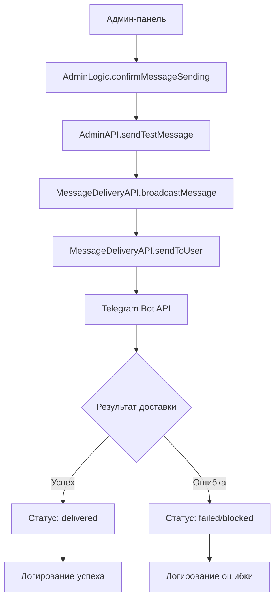
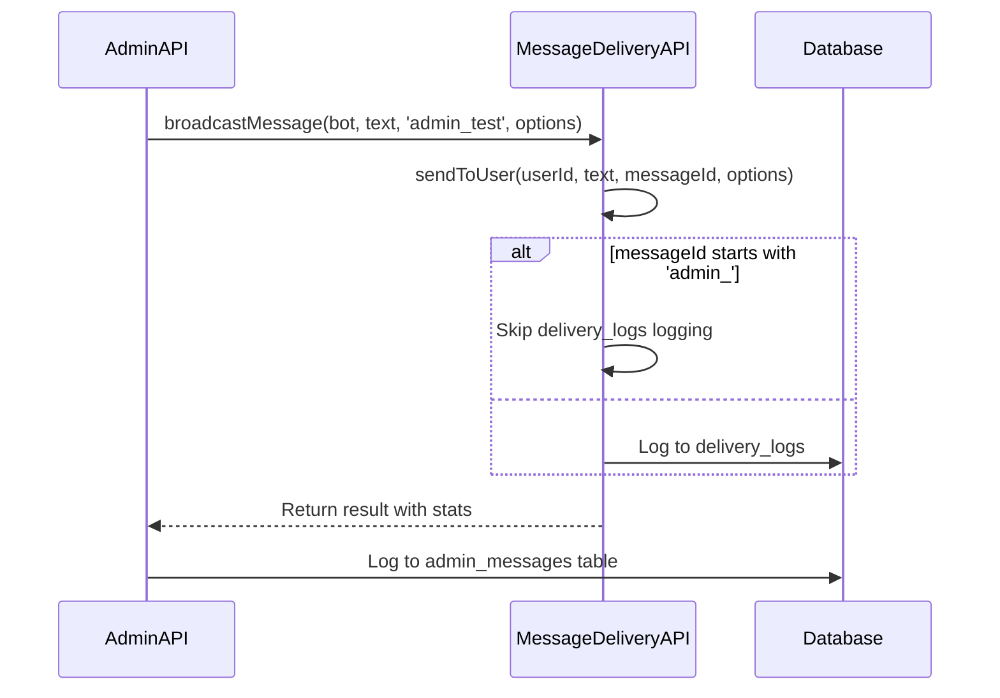

# Исправление ошибки доставки админских тестовых сообщений

## Обзор проблемы

В настоящее время при попытке отправить тестовое сообщение через админ-панель (`texts.admin.message.testMessage`), сообщения не доставляются пользователям и получают статус "ошибка доставки". Проблема требует комплексного анализа и исправления системы доставки сообщений.

## Архитектура системы



## Анализ компонентов

### 1. Компонент AdminLogic

**Файл**: `features/admin/logic.js`

**Функциональность**:

- Обработка подтверждения отправки сообщения
- Вызов API для отправки тестового сообщения
- Отображение прогресса и результатов

### 2. Компонент AdminAPI

**Файл**: `features/admin/api.js`

**Функциональность**:

- Метод `sendTestMessage()` для отправки тестовых сообщений
- Взаимодействие с MessageDeliveryAPI
- Логирование результатов в таблицу `admin_messages`

### 3. Компонент MessageDeliveryAPI

**Файл**: `features/message-delivery/api.js`

**Функциональность**:

- Массовая рассылка через `broadcastMessage()`
- Отправка единичных сообщений через `sendToUser()`
- Логирование доставки в таблицу `delivery_logs`

## Выявленные проблемы

### Проблема 1: Конфликт логирования

**Описание**: В `AdminAPI.sendTestMessage()` используется `messageId = null` для отключения логирования, но `MessageDeliveryAPI.sendToUser()` все равно пытается логировать результат.

**Код проблемы**:

```javascript
// AdminAPI.sendTestMessage()
const result = await this.messageDeliveryAPI.broadcastMessage(
  bot,
  messageText,
  null, // Отключаем логирование в delivery_logs для admin сообщений
  {...}
);
```

### Проблема 2: Некорректная обработка ошибок Telegram API

**Описание**: Метод `sendToUser()` может неправильно обрабатывать специфические ошибки Telegram API.

### Проблема 3: Отсутствие валидации Bot Token

**Описание**: Нет проверки корректности токена бота перед отправкой сообщений.

### Проблема 4: Проблемы с парсингом опций сообщения

**Описание**: Некорректная передача опций parseMode в Telegram API.

## План исправления

### Этап 1: Исправление логирования админских сообщений



### Этап 2: Улучшение обработки ошибок

Добавить детальную обработку ошибок Telegram API:

- `Bad Request: chat not found`
- `Forbidden: bot was blocked by the user`
- `Too Many Requests: retry after X`

### Этап 3: Добавление диагностики

Создать систему диагностики для проверки:

- Валидности bot token
- Доступности Telegram API
- Корректности telegram_id пользователей

### Этап 4: Тестирование системы

Создать тестовую последовательность для проверки:

- Отправки одиночного сообщения
- Массовой рассылки
- Обработки ошибок

## Техническая спецификация исправлений

### 1. Модификация MessageDeliveryAPI.sendToUser()

**Изменения**:

- Добавить проверку префикса `admin_` в messageId
- Улучшить обработку ошибок Telegram API
- Добавить валидацию опций отправки

### 2. Модификация AdminAPI.sendTestMessage()

**Изменения**:

- Передавать уникальный messageId с префиксом `admin_test_`
- Улучшить обработку результатов рассылки
- Добавить дополнительное логирование

### 3. Создание утилиты диагностики

**Функциональность**:

- Проверка bot token
- Тестовая отправка сообщения администратору
- Валидация базы данных пользователей

## Модели данных

### Таблица admin_messages

```sql
CREATE TABLE admin_messages (
    id INTEGER PRIMARY KEY AUTOINCREMENT,
    message_text TEXT NOT NULL,
    message_type TEXT DEFAULT 'test_message',
    sent_by TEXT NOT NULL,
    sent_at DATETIME DEFAULT CURRENT_TIMESTAMP,
    total_recipients INTEGER DEFAULT 0,
    delivered_count INTEGER DEFAULT 0,
    failed_count INTEGER DEFAULT 0,
    blocked_count INTEGER DEFAULT 0
);
```

### Таблица delivery_logs

```sql
CREATE TABLE delivery_logs (
    id INTEGER PRIMARY KEY AUTOINCREMENT,
    user_id INTEGER NOT NULL,
    message_id INTEGER NOT NULL,
    sent_at DATETIME DEFAULT CURRENT_TIMESTAMP,
    status TEXT NOT NULL CHECK (status IN ('delivered', 'failed', 'blocked')),
    error_message TEXT
);
```

## Тестирование

### Тест 1: Единичная отправка

- Отправить тестовое сообщение одному пользователю
- Проверить статус доставки
- Проверить логирование

### Тест 2: Массовая рассылка

- Отправить сообщение всем пользователям
- Отследить прогресс доставки
- Проанализировать статистику

### Тест 3: Обработка ошибок

- Тестировать с заблокированными пользователями
- Тестировать с несуществующими chat_id
- Проверить retry механизм

## Критерии успеха

1. **Успешная доставка**: Тестовые сообщения доставляются корректно
2. **Правильное логирование**: Статистика отображается точно
3. **Обработка ошибок**: Ошибки обрабатываются корректно без сбоев системы
4. **Производительность**: Рассылка выполняется в разумные сроки
5. **Мониторинг**: Администратор получает детальный отчет о доставке

## Мониторинг и логирование

### Логи доставки

```javascript
logger.info("Message delivery attempt", {
  userId,
  messageId,
  messageType: "admin_test",
  status: "delivered|failed|blocked",
  error: errorMessage,
})
```

### Метрики производительности

- Время выполнения рассылки
- Процент успешной доставки
- Количество повторных попыток
- Статистика ошибок по типам
