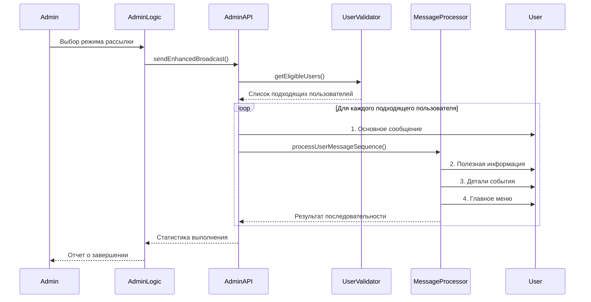

# Улучшенная Админская Рассылка - Руководство по Внедрению

## Обзор

Система улучшенной админской рассылки расширяет базовую функциональность отправки сообщений администратором, предоставляя автоматическую последовательность дополнительных сообщений для пользователей с полными данными в базе данных.

## Архитектура Системы

### Основные Компоненты

1. **MessageSequenceProcessor** - Обрабатывает последовательность сообщений для каждого пользователя
2. **UserDataValidator** - Определяет подходящих пользователей для улучшенной рассылки
3. **Enhanced AdminAPI** - Расширенный API для отправки улучшенных рассылок
4. **Enhanced AdminLogic** - Логика управления режимами рассылки
5. **Enhanced Delivery Logging** - Детальное логирование последовательностей доставки

### Поток Улучшенной Рассылки



## Установка и Настройка

### 1. Миграция Базы Данных

Выполните миграцию для создания таблицы логирования улучшенной доставки:

```bash
# Автоматическая миграция при первом запуске
node database/migrate-enhanced-delivery-logs.js

# Или укажите путь к базе данных явно
node database/migrate-enhanced-delivery-logs.js ./database/bot_database.db
```

### 2. Конфигурация Окружения

Добавьте следующие переменные в ваш `.env` файл:

```bash
# Основное включение функции
ENHANCED_BROADCAST_ENABLED=true

# Настройки временных интервалов (в миллисекундах)
DEFAULT_SEQUENCE_DELAY=2000          # Задержка между сообщениями в последовательности
USER_PROCESSING_DELAY=100            # Задержка между обработкой пользователей
BATCH_PROCESSING_DELAY=1000          # Задержка между пакетами пользователей

# Настройки пакетной обработки
MAX_ENHANCED_USERS_PER_BATCH=10      # Максимум пользователей в одном пакете
MAX_CONCURRENT_SEQUENCES=5           # Максимум одновременных последовательностей

# Настройки тайм-аутов
ENHANCED_DELIVERY_TIMEOUT=30000      # Тайм-аут доставки отдельного сообщения
SEQUENCE_TIMEOUT_MS=60000            # Тайм-аут всей последовательности

# Настройки содержимого последовательности
ENHANCED_INCLUDE_USEFUL_INFO=true    # Включать полезную информацию
ENHANCED_INCLUDE_EVENT_DETAILS=true  # Включать детали события
ENHANCED_TRIGGER_MENU=true           # Активировать меню в конце

# Критерии подходящих пользователей
REQUIRE_FULL_NAME=true               # Требовать наличие полного имени
REQUIRE_ATTENDANCE_STATUS=true       # Требовать статус присутствия
MIN_DATA_COMPLETENESS=50             # Минимальная полнота данных (%)
MIN_ELIGIBILITY_SCORE=40             # Минимальная оценка подходящности

# Настройки логирования
ENHANCED_DETAILED_LOGS=true          # Подробное логирование
LOG_SEQUENCE_STEPS=true              # Логировать каждый шаг последовательности
LOG_USER_ELIGIBILITY=false           # Логировать решения о подходящности пользователей
```

### 3. Включение Функции

По умолчанию улучшенная рассылка включается автоматически при наличии правильной конфигурации. Для ручного управления используйте:

```javascript
const { isEnhancedBroadcastEnabled } = require('./config/enhanced-admin');

if (isEnhancedBroadcastEnabled()) {
  console.log('Улучшенная рассылка активна');
}
```

## Использование

### Для Администраторов

1. **Стандартный Режим**: Отправляет только основное сообщение всем пользователям
2. **Улучшенный Режим**: Отправляет последовательность из 4 сообщений подходящим пользователям

Администратор получает выбор режима при нажатии кнопки отправки сообщения.

### Критерии Подходящих Пользователей

Пользователь считается подходящим для улучшенной рассылки если:

- Присутствует в таблице `users`
- Имеет заполненное поле `full_name`
- Имеет указанный `attendance_status`
- Полнота данных составляет не менее указанного минимума
- Оценка подходящности превышает установленный порог

### Последовательность Сообщений

1. **Основное сообщение** - Исходное админское сообщение
2. **Полезная информация** - Содержимое из `EventInfoAPI.getUsefulInfo()`
3. **Детали события** - Содержимое из `EventInfoAPI.getEventDetails()`
4. **Главное меню** - Автоматическое отображение интерактивного меню

## API Документация

### AdminAPI.sendEnhancedBroadcast(bot, adminUserId, options)

Отправляет улучшенную рассылку с последовательностью сообщений.

**Параметры:**
- `bot` - Экземпляр Telegram бота
- `adminUserId` - ID администратора
- `options` - Объект настроек

**Опции:**
```javascript
{
  messageText: 'Текст основного сообщения',
  config: {
    delays: {
      betweenMessages: 2000,
      betweenUsers: 100
    },
    batching: {
      maxUsersPerBatch: 10
    },
    sequence: {
      includeUsefulInfo: true,
      includeEventDetails: true,
      triggerMenu: true
    }
  }
}
```

**Возвращает:**
```javascript
{
  success: true,
  messageId: 'admin_enhanced_1234567890',
  enhancedStats: {
    total: 100,
    eligibleForEnhanced: 75,
    enhancedSequenceCompleted: 70,
    standardDelivered: 75,
    usefulInfoDelivered: 68,
    eventDetailsDelivered: 65,
    menuTriggered: 67,
    sequenceFailures: 5,
    completionRate: 93.3
  },
  duration: '45 сек'
}
```

### UserDataValidator.getEligibleUsersForEnhancedBroadcast()

Получает список пользователей, подходящих для улучшенной рассылки.

**Возвращает:**
```javascript
{
  success: true,
  users: [
    {
      telegram_id: '123456789',
      full_name: 'Иван Иванов',
      attendance_status: 'attending',
      eligibilityReason: 'Пользователь имеет необходимые данные'
    }
  ],
  stats: {
    total: 100,
    eligible: 75,
    ineligible: 25,
    eligibilityRate: 75
  }
}
```

### MessageSequenceProcessor.processUserMessageSequence(bot, userId, adminMessage, options)

Обрабатывает последовательность сообщений для конкретного пользователя.

**Параметры:**
- `bot` - Экземпляр Telegram бота
- `userId` - Telegram ID пользователя
- `adminMessage` - Текст основного сообщения
- `options` - Настройки последовательности

**Возвращает:**
```javascript
{
  success: true,
  results: {
    sequenceId: 'seq_123456789_1234567890',
    userId: '123456789',
    steps: {
      adminMessage: { attempted: true, success: true, timestamp: '...' },
      usefulInfo: { attempted: true, success: true, timestamp: '...' },
      eventDetails: { attempted: true, success: true, timestamp: '...' },
      menuTrigger: { attempted: true, success: true, timestamp: '...' }
    },
    totalSteps: 4,
    completedSteps: 4,
    errors: []
  },
  completionRate: 100
}
```

## Мониторинг и Логирование

### Таблица enhanced_delivery_logs

Детальное логирование каждого шага последовательности:

```sql
SELECT 
  u.full_name,
  edl.sequence_step,
  edl.delivery_status,
  edl.delivery_timestamp,
  edl.completion_rate,
  edl.error_message
FROM enhanced_delivery_logs edl
JOIN users u ON edl.user_id = u.id
WHERE edl.admin_message_id = 'admin_enhanced_1234567890'
ORDER BY u.full_name, edl.delivery_timestamp;
```

### Расширенная таблица admin_messages

Включает дополнительные поля для улучшенных рассылок:

```sql
SELECT 
  message_text,
  enhanced_mode,
  eligible_users_count,
  sequence_completion_rate,
  sent_at
FROM admin_messages 
WHERE enhanced_mode = 1
ORDER BY sent_at DESC;
```

### Мониторинг Производительности

```javascript
// Получение статистики эффективности
const stats = await adminAPI.userDataValidator.getEligibilityStatistics();
console.log(`Процент подходящих пользователей: ${stats.stats.eligibilityRate}%`);

// Анализ завершенности последовательностей
const completionQuery = `
  SELECT 
    AVG(completion_rate) as avg_completion,
    COUNT(DISTINCT user_id) as total_users,
    COUNT(CASE WHEN delivery_status = 'delivered' THEN 1 END) as successful_steps
  FROM enhanced_delivery_logs 
  WHERE admin_message_id = ?
`;
```

## Устранение Неполадок

### Общие Проблемы

1. **Улучшенная рассылка недоступна**
   - Проверьте `ENHANCED_BROADCAST_ENABLED=true` в .env
   - Убедитесь, что миграция базы данных выполнена
   - Проверьте валидность конфигурации

2. **Низкий процент подходящих пользователей**
   - Проверьте критерии в переменных `REQUIRE_*` и `MIN_*`
   - Убедитесь, что у пользователей заполнены обязательные поля
   - Рассмотрите снижение `MIN_ELIGIBILITY_SCORE`

3. **Высокий процент сбоев последовательности**
   - Увеличьте тайм-ауты (`ENHANCED_DELIVERY_TIMEOUT`, `SEQUENCE_TIMEOUT_MS`)
   - Уменьшите размер пакетов (`MAX_ENHANCED_USERS_PER_BATCH`)
   - Увеличьте задержки (`DEFAULT_SEQUENCE_DELAY`)

4. **Проблемы с производительностью**
   - Включите оптимизацию памяти (`ENABLE_MEMORY_OPTIMIZATION=true`)
   - Уменьшите количество одновременных последовательностей (`MAX_CONCURRENT_SEQUENCES`)
   - Увеличьте задержки между пакетами (`BATCH_PROCESSING_DELAY`)

### Отладка

```javascript
// Включите подробное логирование
process.env.ENHANCED_DETAILED_LOGS = 'true';
process.env.LOG_SEQUENCE_STEPS = 'true';
process.env.LOG_USER_ELIGIBILITY = 'true';

// Проверьте конфигурацию
const { printConfig } = require('./config/enhanced-admin');
printConfig();

// Проверьте состояние миграции
const { checkMigrationStatus } = require('./database/migrate-enhanced-delivery-logs');
const status = checkMigrationStatus('./database/bot_database.db');
console.log('Статус миграции:', status);
```

## Безопасность

### Рекомендации по Безопасности

1. **Контроль доступа** - Только пользователи с ID в `ADMIN_ID` или `ADMIN_IDS` могут использовать улучшенную рассылку
2. **Ограничение скорости** - Встроенные ограничения предотвращают злоупотребление API Telegram
3. **Валидация данных** - Все входящие данные проходят валидацию перед обработкой
4. **Логирование безопасности** - Все админские действия логируются с отметками времени

### Мониторинг Безопасности

```sql
-- Аудит админских действий
SELECT 
  sent_by,
  message_type,
  enhanced_mode,
  eligible_users_count,
  sent_at
FROM admin_messages 
WHERE sent_at >= datetime('now', '-24 hours')
ORDER BY sent_at DESC;

-- Анализ необычной активности
SELECT 
  sent_by,
  COUNT(*) as message_count,
  AVG(eligible_users_count) as avg_recipients
FROM admin_messages 
WHERE sent_at >= datetime('now', '-1 day')
GROUP BY sent_by;
```

## Производственное Развертывание

### Рекомендуемые Настройки для Продакшн

```bash
# Производительность
ENHANCED_BROADCAST_ENABLED=true
DEFAULT_SEQUENCE_DELAY=3000
USER_PROCESSING_DELAY=200
MAX_ENHANCED_USERS_PER_BATCH=15
ENHANCED_DELIVERY_TIMEOUT=45000

# Надежность
MAX_RETRY_ATTEMPTS=3
RETRY_DELAY=2000
FALLBACK_TO_STANDARD=true
CONTINUE_ON_PARTIAL_FAILURE=true

# Логирование (минимизированное)
ENHANCED_DETAILED_LOGS=false
LOG_SEQUENCE_STEPS=false
LOG_USER_ELIGIBILITY=false

# Оптимизация памяти
ENABLE_MEMORY_OPTIMIZATION=true
```

### Мониторинг в Продакшн

1. **Метрики производительности**
   - Время выполнения рассылок
   - Процент завершенных последовательностей
   - Использование памяти и CPU

2. **Метрики качества**
   - Процент подходящих пользователей
   - Частота сбоев доставки
   - Соответствие лимитам Telegram API

3. **Алерты**
   - Снижение процента завершенности ниже 80%
   - Увеличение времени выполнения свыше нормы
   - Превышение лимитов API

## Заключение

Система улучшенной админской рассылки предоставляет мощный инструмент для автоматизации коммуникаций с пользователями, имеющими полные профили в системе. При правильной настройке и мониторинге она значительно улучшает пользовательский опыт и эффективность администрирования.

Для получения дополнительной поддержки или предложений по улучшению, обратитесь к документации API или создайте issue в репозитории проекта.